# Bench 001 — Phase-1 harness tables (Plan 603 T1.5): 9 suites × 2 lanes, honest

**Status:** COMPLETE 2026-09-22 · run commit `a50c751` · release profile ·
M3 (macOS, CPU-only) · laya feature ON · datasets `.raw/datasets/`
(blake3-digested in `.docs/dataset_manifest.md`) · regenerated artifacts
[`001_phase1_tables/TABLES.md`](001_phase1_tables/TABLES.md) +
[`001_phase1_tables/results.json`](001_phase1_tables/results.json) ·
CI lane `.github/workflows/harness_tables.yml` (dispatch-only).

## What ran

`cargo run --release --features laya --bin harness` — both lanes over
**byte-identical questions** (one `Suite`, two renderers): the modelless
engine (`src/engine.rs`) and the G5-parity-gated laya lane
(`src/laya/agent.rs`, three checkpoints). Metrics ported verbatim from
`.docs/laya_bench_protocols.md` §5 (hard metrics, ECE-15 left-open/right-
closed, Brier multi-class, NLL, AURC, acc@50/80, soft/score extras).

Per-suite protocol: typed_decisions ALL 400 rows (2000 questions);
ag_news/emotion 400; sst5 600; prompt_injections ALL 116; xnli_en 300;
massive_intent_en 300 (option universe from the FULL fetched split, 59
intents); banking77 500 (universe = 77, `mteb/banking77` mirror); 
code_fixtures 16 generated cases (this repo's own fn spans, gold
programmatic). Laya checkpoints: `typed` + `english` + `multilingual` on
typed_decisions, `english` elsewhere (the reference's own layout).

## Headline

| suite | n | modelless acc | best laya acc | modelless p50 | laya p50 |
|---|---|---|---|---|---|
| typed_decisions | 2000 | 0.2780 | **0.7445** (`typed`) | 0.5 ms | 4493 ms |
| ag_news | 400 | 0.2575 | **0.9500** | 0.2 ms | 388 ms |
| emotion | 400 | 0.2950 | **0.5925** | 0.1 ms | 170 ms |
| sst5 | 600 | 0.1567 | **0.3717** | 0.1 ms | 204 ms |
| prompt_injections | 116 | 0.4828 | **0.6983** | 0.1 ms | 169 ms |
| xnli_en | 300 | 0.3333 | **0.8600** | 0.1 ms | 344 ms |
| massive_intent_en | 300 | 0.0767 | **0.7500** | 0.1 ms | 529 ms |
| banking77 | 500 | 0.0400 | **0.4980** | 0.3 ms | 773 ms |
| code_fixtures | 32 | 0.2500 | **0.5625** | 0.1 ms | 1051 ms |

## Protocol validation (the port reproduces the reference)

laya[english]/laya[typed] numbers vs the reference's published
(`.raw/laya/BENCHMARKS.md`): ag_news **0.9500 vs 0.953** · emotion **0.5925
vs 0.600** · typed_decisions[typed] **0.7445 vs 0.766** · base checkpoints
**0.3575/0.3490 vs "base ~0.36, below the 0.461 majority baseline"**.
Within sampling/precision noise — the Rust port reads the same checkpoints,
tokenizers, temperature tables, and question envelope.

## The honest reading (losses are the point)

1. **The modelless lane is corpus-bound by design** and loses to pretrained
   encoders on every OOD text suite — the zero-shot breadth loss is
   structural (plan caveat 4). Its G1 calibration, however, PASSES 8/9
   suites: when the scorer carries no signal, the sigmoid-gate calibrator
   collapses confidence to the base rate and the reported confidence is
   honest (ECE 0.02–0.05 where raw readout ECE was 0.15–0.33, always
   beating the conformal-naive floor 0.30–0.70).
2. **G1 FAIL on massive_intent_en** (raw 0.020 → calibrated 0.034): the
   routing head is confidently wrong there (cos-trained centroids vs 59
   single-word-intent corpora) and Platt cannot repair a non-monotone
   signal. Recorded, not tuned away.
3. **Abstain-everything is correct autonomous behavior**: on suites where
   the calibrator learns "always wrong" (ag_news cal window pos=0,
   banking77 pos=1/200) confidence collapses to exactly 0.0 and the engine
   abstains everything rather than guessing. ⚠ **Readout-ECE 0.000 on
   those rows is a BINNING ARTIFACT** — the protocol's ECE bins are
   left-open `(0,1]`, so zero-confidence rows fall in NO bin. Read those
   as n/a, never as perfect. The hard-ECE column (max-prob confidence) is
   unaffected.
4. **Latency is the modelless lane's claim to keep**: 0.05–0.5 ms per
   decision set vs 170 ms–4.8 s per laya case (~10³–10⁴×), at ~10⁶× fewer
   parameters. Determinism ✓ on both lanes (repeat-run bit-identity, first
   10 cases per suite — the published determinism claim stays scoped to
   the modelless lane, plan caveat 3).

## Measured lessons paid for on the first runs

- **The fused-gate birth thresholds (0.35/0.5) do NOT transfer.** At the
  birth constants the distance gate abstained 64–100% on real-corpus
  suites. The harness now FITS both thresholds per suite at the cal-slice
  30th percentile (the T1.6 arena posture ρ=30%); fitted values ride each
  result row.
- **The calibration slice must not sit inside its own reference corpora** —
  a cal case scoring cos 1.0 against ITSELF inflated every cal quantile
  and over-armed the gates (corpus pool now starts AFTER the cal slice;
  measured: ag_news abstain 64→34% at the same ρ target).
- **banking77 corpora must bind to the option-key vocabulary** (stripped
  `label_text`): int-label corpora silently self-doc-fallback'd every
  domain (acc 0.058 → 0.040 after the fix, with routing actually armed).
- **code-fixture slices must be strictly disjoint** (eval [0..2] /
  cal [2..10] / corpus [10..16]) — the first version let small modules'
  cal fns leak into their own corpus.

## Protocol divergences (deliberate, documented in the tables too)

- MASSIVE option sampling: SplitMix64 (fixed seed), NOT CPython MT19937 —
  the comparison integrity that matters is that BOTH lanes here answer
  byte-identical questions.
- banking77: `mteb/banking77` mirror (the reference's own bench_apps
  variant); PolyAI/banking77 is script-based and unservable (manifest
  Gaps).
- Engine context = state + prompt (wire `criteria` None) — the modelless
  serving path.
- Laya latency here is per-CASE (system_one over the case's questions,
  unpadded), CPU-only — NOT comparable to the reference's batched-GPU
  32.8 ms/question claim; the table's p50/p99 are the honest local
  numbers.

## Addendum (same day, owner directive "test both on the M3"): same-box latency, original vs port

The reference's published 32.8 ms/question was a T4-GPU batched run — not a
same-box claim. Measured here: the ORIGINAL laya (pinned `.raw/laya`, torch
2.14.0, via the capture venv — measurement-only Python, never lane code)
and this port (candle), both over the SAME G5 fixture corpus rows (75/75/105
per checkpoint), one `system_one` call per row, warmup pass + 3 timed
passes. Probe: `scripts/probe_orig_laya_latency.py` (original) +
`examples/laya_fixture_timing.rs` (port).

| checkpoint | orig torch CPU (row p50) | orig torch MPS (row p50, interleaved) | port candle CPU (row p50) | port candle METAL (row p50, interleaved) |
|---|---|---|---|---|
| english | 110 ms | **29.3–31.2 ms** | 198–254 ms | 37.0–43.8 ms |
| typed | 296 ms | **25.4–31.6 ms** | 200–248 ms | 43.7–45.9 ms |
| multilingual | — | **14.7–17.6 ms** | 95–112 ms | 20.9–23.3 ms |

Reading (honest in both directions):
- **Port CPU is ~2× SLOWER than torch CPU** (candle's CPU kernels are
  simpler than torch's).
- **Port METAL is ~1.3–1.5× SLOWER than the original's own MPS.** The
  first version of this addendum claimed the opposite ("at parity or
  faster") — that was a CROSS-SESSION comparison where the python side
  ran under box load (43.9/44.6/24.8) and this side did not. The
  interleaved back-to-back A/B above (alternating python/rust rounds, 6
  readings, python wins every checkpoint in every round) is the verdict:
  torch MPS 25–31 / 14–18 ms vs candle Metal 37–46 / 21–23 ms. The
  loaded-vs-unloaded swing on the python side alone (english 22.9 → 50.1
  across sessions) is the box-state lesson this workspace keeps paying
  for: same-box interleaved or it did not happen.
- G5 parity is GREEN at BOTH postures (CPU and Metal, the same ≤ 1e-3
  gate) — the port computes the same function. The latency gap is
  candle's Metal kernels vs MPSGraph maturity, not our code (Bench 002:
  heal-class perf rules on our side move nothing). The port's wins remain
  deployment: no Python, no torch runtime, one SHA-256-pinned binary.

### The chart (python vs rust, both M3 Metal, interleaved rounds)

```mermaid
xychart-beta
    title "laya on M3 Metal: python (torch MPS) vs rust (candle Metal), row p50 ms — lower is better"
    x-axis ["english", "typed", "multilingual"]
    y-axis "ms" 0 --> 50
    bar [30.3, 28.5, 16.2]
    bar [40.4, 44.8, 22.1]
```



(python = bar 1: the interleaved rounds' midpoints 30.3 / 28.5 / 16.2;
rust = bar 2: midpoints 40.4 / 44.8 / 22.1. Raw readings — python:
31.2, 29.3 english · 25.4, 31.6 typed · 14.7, 17.6 ml; rust: 43.8, 37.0
english · 45.9, 43.7 typed · 20.9, 23.3 ml. torch MPS wins every
checkpoint in every round; the gap is candle-vs-MPSGraph kernel maturity,
G5-parity-green on both sides.)

## Addendum 2 (2026-09-22): the riir-owned lane joins — the three-way chart

The `laya-riir` backend (no candle; `gemm` + `libm` version-matched to
candle's own calls, `.issues/002` + `.issues/003`) landed with its G5 gate
GREEN: top-1 agreement 1.000000 ×3 checkpoints, prob drift 1.03e-6 /
1.83e-6 / 3.01e-6 against the 1e-3 gate — the candle lane's own drift
class. Latency, SAME SESSION over the same fixture corpus
(`examples/laya_fixture_timing`, lane arg; 75/75/105 rows × 3 reps):

| checkpoint | riir CPU v1 (row p50) | port candle CPU (row p50) | port candle METAL (row p50) | python torch MPS (row p50, interleaved rounds, addendum 1) |
|---|---|---|---|---|
| english | 188.7 ms | 192.2 ms | **31.1 ms** | 30.3 ms |
| typed | 201.0 ms | 182.9 ms | **30.9 ms** | 28.5 ms |
| multilingual | 91.8 ms | 93.3 ms | **18.3 ms** | 16.2 ms |

Honest reading (all four columns device-labeled; the MPS column is the
RECORDED interleaved midpoints, not a today re-run — python is
measurement-only tooling on the capture venv, and the box-state lesson
says same-session interleaved or it did not happen):

- **riir CPU ≈ candle CPU at parity** (deltas 1.8% / −9.9% / −1.6%,
  inside run-to-run noise) — the version-matched `gemm` dep working as
  designed: both lanes call the SAME kernel, so the A/B measures the
  surrounding code, which is also the same op order. The riir lane's
  identity win is deployment: the prod path builds candle-free.
- **Metal kernels are the later optimization** (owner directive 2026-09-22:
  "we will optimize later") — riir is CPU f32 v1 by construction and
  `LAYA_DEVICE` is not consulted, so a reading can never silently come
  off the posture its G5 gate verified. The Metal row exists in the
  chart as the target the optimization aims at, not a claim about riir.
- The candle-Metal same-session readings (31.1/30.9/18.3) sit BELOW
  addendum 1's interleaved numbers (37–46/44–46/21–23) — a box-state
  move, not a code change; recorded here so the two columns are not
  read as one instrument.

### The three-way chart (python MPS / candle Metal / riir CPU v1, M3, row p50 ms)

```mermaid
xychart-beta
    title "laya on M3: python MPS vs candle Metal vs riir CPU v1, row p50 ms — lower is better"
    x-axis ["english", "typed", "multilingual"]
    y-axis "ms" 0 --> 200
    bar [30.3, 28.5, 16.2]
    bar [31.1, 30.9, 18.3]
    bar [188.7, 201.0, 91.8]
```



(python MPS = the interleaved midpoints from addendum 1; candle Metal =
today's same-session readings; riir = today's CPU v1 readings,
device-labeled — the y-axis is stretched by the CPU bar on purpose:
the gap IS the result.)
## Addendum 3 (2026-09-22): the riir CPU lane gets measured threading (rust-optimize pass)

The lane shipped with `Parallelism::Rayon(available_parallelism)` — 16
workers on this box — on EVERY gemm, the 576 tiny per-head attention
gemms (~0.3 MFLOP each) included. A `sample` profile of the timing
harness (10 s, 40-rep run) decomposed the main thread:

- **~57% in `matmul_*` → gemm `LockLatch::wait_and_reset` →
  `pthread_cond_wait`** — the calling thread waits for its slowest
  worker on every projection, while the 16 pool workers sat mostly in
  `wait_until_cold` (idle-spin between bursts);
- **~14% `glu_gelu_gate` → `libm::erff`** — real compute, and
  untouchable (the gelu kernel IS candle's, `.issues/003`; the
  bit-parity law spends the G5 budget on reduction order only);
- tokenization + head + softmax/LN sums: noise (≤2% each).

Two threading fixes, both bit-preserving by construction and both
G5-verified (`laya_riir_parity` green; drift numbers BYTE-IDENTICAL to
the addendum-2 record: 1.829e-6 / 1.033e-6 / 3.013e-6, agreement
1.000000):

1. **`Parallelism::None` under 8 MFLOP** (`SINGLE_THREAD_FLOPS`) —
   gemm-fallback parallelizes over the OUTPUT range only, so a
   single-thread call is the same adds in the same order; the tiny
   per-head gemms stop paying a 16-way dispatch for ~5 µs of compute.
2. **Worker cap 8 + `OnceLock`-cached resolve** — the auto-detected
   count is `min(available_parallelism, 8)`; an explicit
   `RAYON_NUM_THREADS` overrides verbatim, uncapped. Back-to-back sweep
   (SAME binary, 15–25 reps, minutes apart):

| RAYON_NUM_THREADS | english row p50 |
|---|---|
| 16 (old default) | 203.8 ms |
| 12 | 183.6 ms |
| **8 (new default)** | **156.0 / 156.8 ms** |
| 10 | 157.9 ms |
| 6 | 182.6 ms |

The mechanism is not "fewer is faster": every gemm join waits for its
slowest worker, so the 4 E-cores pace every projection — and the
calling thread itself computes between gemms (the gelu), which made 17
compute threads on 12 fast cores oversubscribed. 8 keeps the pool on
P-cores with headroom. Box-state caveat (the rule this repo pays for):
these sweep cells are internally consistent (one binary, back-to-back)
but ABSOLUTE numbers inflate ~25% when sibling agents compile
concurrently — a re-run of the same default posture under a sibling
build read 194.7 ms. The ordering (8 ≈ 10 < 12 < 16) is the claim; any
absolute p50 is a load-class reading.

Net: **16 → 8 workers ≈ −24% row p50** on the loaded M3 (203.8 →
156.0 back-to-back), plus the removed per-call env/sysctl scan and the
tiny-gemm dispatches. Numerics unchanged at ANY thread count
(output-split parallelism — the G5 gate is count-independent, asserted
at both the switch and the cap).

## Re-run

```sh
scripts/fetch_datasets.sh          # idempotent; blake3 manifest
cargo run --release --features laya --bin harness
# Metal posture (owner directive; G5 re-verified green there):
LAYA_DEVICE=metal cargo run --release --features laya-metal --bin harness
```

~2.5 h wall on the M3 (laya[typed] on typed_decisions is the long pole:
~38 min per checkpoint at 1024 tokens, unpadded CPU forwards).

## Addendum 4 (2026-09-22): the GLU gets an elementwise worker pool (rust-optimize pass, cont.)

After the threading pass, the profile's one big SERIAL compute item left
is the GLU: `seq·I` `libm::erff` calls on the calling thread between
gemms while the pool workers sit parked (~13–14% of the forward wall in
both profiles — addendum 3's and a fresh post-fix re-profile, whose
decomposition was otherwise unchanged). `erff` itself stays
bit-parity-locked (`.issues/003`), so the fix is THREADS, not a
different kernel: `ops::glu_gelu_gate` now splits the OUTPUT element
range across a persistent condvar-parked pool (`num_threads()` workers
— the same resolution the gemms use, so `RAYON_NUM_THREADS` keeps its
verbatim-override semantics; 1 worker or < 32 K elements = the serial
row form). Every element runs the same scalar expression — the same
argument as gemm-fallback's output split, and the G5 gate re-proves it:
drift BYTE-IDENTICAL to the record (1.829e-6 / 1.033e-6 / 3.013e-6,
agreement 1.000000, all three checkpoints), plus a lib test pinning
pool-vs-serial bit-identity across mid-row chunk boundaries and a
determinism pin.

**Measurement box state: THERMAL.** The box was thermally throttling
through this session (owner report), on top of load 12–18 from sibling
builds. Consequences, read honestly:

- **End-to-end row p50 is UNMEASURABLE today** — two back-to-back runs
  of the IDENTICAL baseline binary read 808.7 and 314.9 ms (a 2.6×
  spread), and per-pair pool/baseline deltas bracketed zero (−27% /
  +3% / −38%). No e2e figure is claimed. A quiet-box re-run owes the
  number.
- **The op-level claim is the in-process interleaved A/B** (the
  `tests/common/ab_timing.rs` law: both arms run milliseconds apart, so
  throttle hits both equally; median of 40 pairs, bit-identity asserted
  every pair):

| GLU shape | serial | pool | median ratio |
|---|---|---|---|
| 512×1152 | 11.77 ms | 4.44 ms | **2.65×** (1.29–4.96) |
| 512×2624 | 25.50 ms | 8.93 ms | **2.86×** (1.29–4.96) |

  The ratios fall short of the 9-thread ideal because the sibling load
  owns most P-cores during the run — under the same load the serial arm
  is equally contended, which is what the interleaved pairing controls.

Expected end-to-end from the profile share: ~13% × (1 − 1/2.7) ≈ 8–9%
wall — below today's noise floor, hence the quiet-box debt. No
numerics moved: the G5 drift triple is byte-identical, and the pool is
bit-transparent at every worker count (the flat output-index split
preserves `e == r·I + j`, so chunk boundaries mid-row change nothing).

**Quiet-box debt PAID (same day, ~19:55, load 4.3–9.8 falling and the
owner confirming the thermal state had cleared): 4/4 interleaved pairs
show the pool ahead — 177.5→161.0 / 181.7→166.0 / 193.5→173.0 /
189.1→169.2 ms row p50, median −9.6%, matching the profile-share
prediction.** Baselines drifted 177→193 ms as sibling load crept
(7.6→9.8); the pairing absorbs it. Absolute postures remain load-class
readings — the ratios and the 4/4 direction are the claim.

## Addendum 5 (2026-09-22) — the engine option-rank blend moved the modelless lane off chance (Issue 004 T7)

(Allocated as "Addendum 4" in `6759a79` before the collision with the
GLU-pool addendum above was seen — renumbered in the doc-only fix.)

Claude verdict round 3 (session `77700b06`) probed the Issue-004 family
engines and found **4 of 5 emitting a CONSTANT input-independent pick** —
accuracy sat at exactly the gold=0 rate, which class-balanced fixtures
made indistinguishable from honest chance. Root cause was in the ENGINE,
not the fixtures: `solve_into` ranked options by the LZ4 drafter delta
alone, where a 4–6-byte option string never moves the compressed length
of a ~300-byte shared context — every option scored identically and ties
broke to index 0. The fix blends the drafter delta with the state's
cosine to each option's corpus centroid (`ROUTE_SCALE = 8`, state-alone
embedding — the prompt/criteria carry every label word and would tilt
the cosines). Discrimination floor added to the family gates
(distinct picks ≥ 2 AND distinct vectors ≥ 2 per family).

Regenerated same day (`--skip-laya`; the laya lane does not consume this
engine and its numbers stand). Before/after from the committed
`results.json` vs this run — the direction is MIXED and recorded
both ways:

| suite | n | before | after | chance |
|---|---|---|---|---|
| typed_decisions | 2000 q | 0.2780 | **0.3190** ↑ | — |
| ag_news | 400 | 0.2575 | **0.5100** ↑ (2.0× chance) | 0.25 |
| emotion | 400 | 0.2950 | 0.2825 ↓ (−1.3 pt) | 0.167 |
| sst5 | 600 | 0.1567 | **0.2167** ↑ | 0.20 |
| prompt_injections | 116 | 0.4828 | 0.4397 ↓ (−4.3 pt) | 0.50 |
| xnli_en | 300 | 0.3333 | 0.3467 ↑ | 0.333 |
| massive_intent_en | 300 | 0.0767 | 0.0767 = | ~0.017 |
| banking77 | 500 | 0.0400 | **0.4460** ↑ (~34× chance) | 0.013 |
| code_fixtures | 32 q | 0.2500 | 0.2500 = | 0.125 |
| harness_visibility | 16 | (constant pick) | 0.3750 | 0.25 |
| harness_permissions | 12 | (constant pick) | 0.4167 | 0.333 |
| harness_tool_fit | 12 | (constant pick) | 0.5000 | 0.167 |
| harness_routing | 16 | (constant pick) | 0.4375 | 0.25 |
| harness_sensitivity | 15 | (constant pick) | 0.4000 | 0.20 |

Reading: decisive wins where the state text carries discriminative
vocabulary for fine-grained option universes (banking77 77-way,
ag_news, sst5, typed_decisions); small regressions on the two suites
nearest chance (emotion −1.3 pt, prompt_injections −4.3 pt on a 2-way);
byte-identical accuracy where the state vocabulary does not overlap the
option corpora (massive_intent, code_fixtures — zero picks flipped).
The primary GOAT is the degeneracy fix itself: a constant pick
certifies nothing and made the lane's confidence/abstention surfaces
meaningless on those families. The per-suite deltas are published, not
gated; if the owner wants the old scorer back on specific suites, a
toggle is a follow-up decision, not smuggled in here. G2/G4 unchanged
(p99 53 µs / alloc-free on decision_set_goat; family p99 59–79 µs,
tail support 11/1000 — box state: M3 Max, AC power, two sibling laya
cargo agents actively building on the same repo during the run).

## Addendum 6 (2026-09-22): the fair all-Metal three-way — riir's own MSL backend joins the chart (Issue 005)

The owner's correction: *"the `laya riir` must be metal, all test must be
metal for fair compare."* Addendum 2's chart was device-mismatched — the
riir column was CPU v1 (188.7/201.0/91.8 ms) against two GPU lanes. This
addendum supersedes it with the fair compare; the CPU numbers stay on
record as the v1 baseline (and Addendum 3/4's threading work applies to
them).

**The lane** (`laya-riir-metal`, commit-chain `07039c1` boundary →
`a3e7c49` landing): 14 MSL kernels — one stride-general 16×16-tiled GEMM
covering all three matmul shapes, candle's A&S erf gelu transcribed
verbatim, elementwise/row kernels; per-op committed command buffers with
candle's LAZY flush shape (encode-only; sync at the three host reads);
explicit Tracked hazards; permanent (ptr,len) weight cache + per-pass
chain cache keyed by forward. `LAYA_DEVICE=metal` honored, fail loud.

**G5 at the Metal posture (the gate law — green BEFORE any number is
published):** english 26/26 · typed 26/26 · multilingual 36/36 top-1,
prob drift 5.981e-6 / 1.585e-6 / 5.159e-6 vs the 1e-3 gate — the same
drift class as candle Metal itself. The gate caught FOUR real defects on
the way (all recorded in `src/laya/riir/metal.rs`'s module doc): the
weight cache stale-serving recycled activation addresses; sync-count
eviction vs slots that live a whole forward; candle's
HazardTrackingModeUntracked being wrong for per-op command buffers
(macOS default is untracked too — Tracked is explicit); and the layer-0
host copy reading stale residual bytes.

**The measurement** (same session, interleaved rounds, warmup + 3 timed
passes per reading, 2 rounds per lane per checkpoint; box state: M3 Max
AC, load 5-8 with sibling agents building — all lanes share the load):

| checkpoint | torch MPS (row p50) | candle Metal (row p50) | riir Metal (row p50) |
|---|---|---|---|
| english | **25.6 / 25.7** | 31.3 / 30.9 | 79.0 / 78.8 |
| typed | **25.5** | 31.1 / 31.2 | 78.6 / 78.7 |
| multilingual | **16.0 / 16.5** | 18.7 / 18.7 | 38.5 / 38.5 |

Reading (honest in both directions):
- torch MPS wins every checkpoint; candle Metal is 1.2-1.5× behind it;
  riir Metal v1 is 2.5× behind candle — exactly the "naive kernels land
  slower than candle's tuned Metal path — acceptable, chart it honestly"
  the issue scoped. The measured gap decomposition: one naive tiled GEMM
  vs candle's MLX simdgroup kernels, per-op dispatch overhead (~1100
  encodes/forward at ~0.04-0.09 ms encode+commit), and per-forward
  activation re-uploads (the chain cache is per-pass, not persistent).
- The lazy-flush shape matters: a literal per-op commit+wait measured
  0.59 ms/dispatch round trip — 2.5 s/forward, 280 s for the gate corpus;
  the lazy shape runs the same corpus in 15 s (~19× faster) with
  identical numerics.
- The optimization ladder (owner already scoped "optimize later"):
  persistent device-resident activations across forwards, fused
  elementwise chains, and a simdgroup GEMM. The chart is the baseline
  that work measures against.

## Addendum 6 (2026-09-23, Issue 004 T3 completion) — the laya lane's full harness run lands (cache_reuse answered)

T3's deferral was "the laya-lane numbers ride the next full harness run
with weights present" — the weights are on this box
(`~/.cache/riir-reflex/laya/{english,typed,multilingual}`, downloaded
09-22) and this run is that run. `cargo run --release --features
laya-riir --bin harness`, UNCAPPED (laya_max_questions = 0, the protocol
default), 15 suites, PASSED with no absences. Tables + results.json
regenerated in `.benchmarks/001_phase1_tables/` at reflex HEAD `2aa2dda`
— the sha the header carries, because the laya tree (`src/laya`) is
scheduled to move to the riir-infer repo (008 T4): **these laya columns
are a PRE-MOVE BASELINE**, labelled as such in the TABLES.md header, and
a laya number quoted without that sha measures a tree that no longer
exists here. Runner disclosure hardening in the same commit: `RunMeta`
carries `laya_max_questions`, the header prints the PRE-MOVE-BASELINE
line whenever the laya feature is on, prints an explicit PARTIAL-run cap
line when a question cap is applied (the capped laya `n` columns are
never comparable row-wise against full-N modelless `n`), and the
LLM-only family's blockquote now says "the laya lane answered below"
when it did — instead of a stale "compile with --features laya" on a
table that has laya rows.

**The T3 headline:** `harness_cache_reuse` (12 authored reuse-vs-rebuild
prefix scenarios, binary gold) — laya·english acc **0.5000** (chance
0.5000), macro F1 0.3333, ECE(maxp) 0.3618, p50 227 ms, determinism ✓.
Read honestly, TWICE. Power first: n = 12 puts the 95% CI on that acc at
roughly [0.21, 0.79] — "exactly chance" is one flip from 0.583, so this
is a weak refutation, not a precise one. And the signature is sharper
than a coin flip anyway: macro F1 **0.3333** with mean confidence
**0.8618** (ece = 0.8618 − 0.5; brier 0.754, nll 1.050) is the shape of
a CONSTANT CONFIDENT predictor — one class answered for all 12 cases
(the fixtures are 6/6 balanced, so a constant `reuse` scores exactly
6/12 = 0.500) — not a hedge. The laya forward does not fail to surface a
prefix-reuse signal here; its readout COLLAPSES to one class and stays
confident about it. The modelless substrate has no KV cache by
construction, so this family was never a modelless claim — but the next
attempt should aim at the readout (per-class calibration / a class-prior
correction / a cache-metrics-derived feature), not at re-running the
same forward and hoping for variety. The `noul` vocabulary rides the
WIRE; this row exists so that next attempt starts from a measurement
with its power and its mechanism named, not from the scaffold.

Box state (the disclosure the latency columns need): M3 Max, release
profile, CPU lane (LAYA_DEVICE unset), loadavg 8-14 rising to ~20-33
with sibling agents' cargo builds through the typed_decisions leg — the
p50 spikes there (typed 3624 ms vs the ~210 ms quiet-suite figure) are
LOAD, not the port; ag_news→cache_reuse read 151-832 ms on the same
run. Wall: ~78 min detached (two runs: the first foreground attempt was
tool-timeout-killed at 60 min under the same load — no partial output,
the detached rerun is the recorded one). Checkpoint coverage is the
runner's own protocol: typed_decisions × 3 checkpoints, every other
suite × english.
