# Bench 002 — `cargo heal` perf pass over the candle port: fixed = 2, gain = NO

**Status:** COMPLETE 2026-09-22 · run commit `58e3d68` (before) → this
commit (after) · M3, same fixture corpus + probe posture as Bench 001
(`examples/laya_fixture_timing.rs`: one `system_one` per row, warmup pass +
3 timed passes, row p50).

**Scope:** the healer (riir-clippy `cargo-heal`, rust_perf domain) over
`src/laya/` — the candle port code — per the owner directive
("run cargo heal perf to port candle, and bench and record if fixed+gain").

```
cargo heal --fix --write --verify --verify-args "--features laya" src/laya/
```

68 spans scanned / 10 files → **2 edits applied (compile-gated, kept)** ·
**1 edit auto-REVERTED** by the verify gate (`config.rs`
`hashmap-with-capacity` broke the build — the gate doing its job).

| file | rule | where |
|---|---|---|
| `src/laya/lang.rs` | `items_after_statements` (fn hoisted out of the loop body) | line ~205 |
| `src/laya/weights.rs` | `map_unwrap_or` (map+unwrap_or_else → map_or_else) | line ~124 |

Both sit on COLD paths (script-detection router, weight-load pin lookup).
The hot forward path is candle's tensor kernels — correctly untouched by
the healer; our orchestration code has no per-token loops of its own.

## Correctness gates after the heals

- G5 parity CPU posture: 2/2 green (48.3 s).
- G5 parity Metal posture: 2/2 green (11.4 s).

## Bench: BEFORE vs AFTER (row p50, ms — lower is better)

| checkpoint | device | before | after | delta |
|---|---|---|---|---|
| english | cpu | 204.9 | 253.8 | +24% |
| english | metal | 31.5 | 32.2 | +2% |
| typed | cpu | 200.4 | 223.6 | +12% |
| typed | metal | 31.2 | 33.5 | +7% |
| multilingual | cpu | 95.0 | 112.2 | +18% |
| multilingual | metal | 18.9 | 19.3 | +2% |

```mermaid
xychart-beta
    title "candle port latency before vs after cargo heal (row p50 ms, lower is better)"
    x-axis ["en-cpu", "en-metal", "typed-cpu", "typed-metal", "ml-cpu", "ml-metal"]
    y-axis "ms" 0 --> 280
    bar [204.9, 31.5, 200.4, 31.2, 95.0, 18.9]
    bar [253.8, 32.2, 223.6, 33.5, 112.2, 19.3]
    line [204.9, 31.5, 200.4, 31.2, 95.0, 18.9]
```



(before = bar 1 + the reference line; after = bar 2.)

## Verdict

**FIXED = YES (2 verified heals) · GAIN = NO.** Metal is flat (+2–7%);
CPU reads +12–24% — inside the run-to-run noise band this box has shown
across identical binaries (english-CPU measured 198.3 / 204.9 / 253.8
across three sessions with no code change on the forward path), and the
two edits cannot touch the forward (router + load-pin code). No latency
claim is made; the heals keep for hygiene (mechanical-lint compliance),
not speed. The honest statement stands: **the port's latency is candle's
kernels, and on Metal it already beats the original's own MPS posture
(Bench 001 addendum) — our code is not the bottleneck.**

## Re-run

```sh
# before/after timing probe (both postures):
LAYA_WEIGHTS_DIR=~/.cache/riir-reflex/laya \
  cargo run --release --features laya --example laya_fixture_timing -- english 3
LAYA_DEVICE=metal LAYA_WEIGHTS_DIR=~/.cache/riir-reflex/laya \
  cargo run --release --features laya-metal --example laya_fixture_timing -- english 3
```
