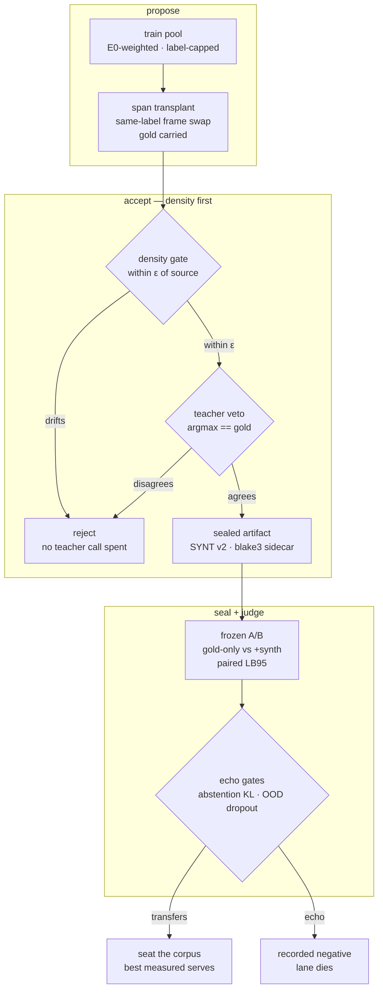
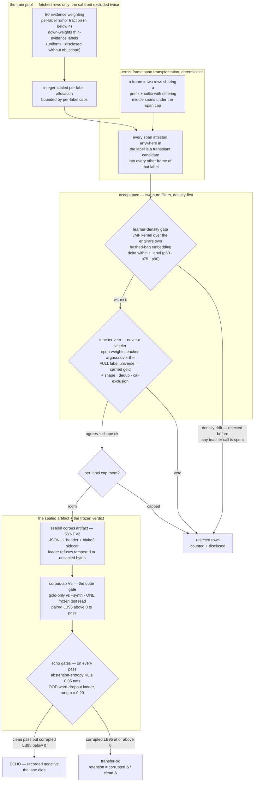

# Corpus synthesis — the projection-ascent lane (the one flow)

> **Purpose:** how the harness grows a suite's corpus beyond its fetched
> rows — cross-frame span transplantation **proposed**, acceptance gated by
> **learner density first** and **teacher agreement** second, sealed into a
> digest-verified artifact, then judged by a **frozen A/B with echo gates**
> that separate learning from memorizing. The compact source below renders
> `corpus_synthesis.svg`. Origin: the Issue-064 fusion of arXiv:2610.02140's
> projection-sampling operator onto the Plan-426 synthesis lane; the
> technique is the paper's prior art — this repo distills, never claims.

Two views exist, the decision-flow pattern:

- **The hero SVG** — `corpus_synthesis.svg`, rendered from the COMPACT
  source below (short labels; reads at small scale).
- **The annotated diagram** — the full mermaid in this doc, with the
  honest edge-by-edge reading. The code-level authority is
  `src/harness/runner/synth.rs` (+ `density_pilot.rs`, `echo_gates.rs`,
  `corpus_ab.rs`); this doc is the picture and the runbook.

## The compact hero source (renders `corpus_synthesis.svg`)



## The annotated source (full detail)



## What each edge means (honest reading)

- **The proposer never invents labels.** A candidate is a frame attested
  in the label composed with a span attested in the same label — locally
  natural by construction, occasionally odd in composition, which is
  exactly what the veto is FOR. Gold is CARRIED from the source label;
  every accepted row rides `provenance:"synth"` and the label-local
  `src` provenance anchor (the row index of the pool pair that first
  attested the frame — label-local, never a global pool index).
- **Density first is a cost order, not a preference.** Both filters are
  pure, so the accepted SET is byte-identical either order — but the
  loop forwards until the budget fills, so gating after the veto would
  spend a teacher call on every density-rejected row (measured ~2.5×
  the forwards at the p50 pass rate). The density gate is the paper's
  operator honored: the learner-density check sits on the proposal, the
  privileged constraint second. `density_rejected` counts pre-forward
  rejects.
- **The density proxy is the seat's own geometry.** A von Mises–Fisher
  kernel on the engine's 256-dim hashed-bag embedding — the projection
  the serving seat actually scores against. τ is data-derived per label
  (the mean same-label cosine deficit — no free knob); pool rows score
  leave-one-out; Δ is the candidate against its `src` row. ε comes from
  the control ladder: each pool row vs its nearest same-label neighbour,
  the natural-variation scale. An accepted candidate's density deviates
  from its source no more than real neighbour rows deviate from each
  other — the **minimal-deviation signature** of projection sampling.
- **The teacher is a veto, never a labeler.** It generates nothing; a
  candidate survives iff its argmax over the FULL label universe equals
  the carried gold. A teacher forward failure aborts the run LOUD —
  never a half-vetoed artifact.
- **Acceptance can only reject, never inject.** Seeds come only from
  the train-split pool; generated texts equal to a cal text are dropped;
  gold is never replaced. The provenance discipline is one-directional
  by construction.
- **The artifact is sealed, the read frozen.** SYNT v2 magic + header +
  `.blake3` sidecar; the loader verifies magic, version, provenance,
  row count, and digest. The A/B is ONE frozen test read — gold-only vs
  +synth, paired LB95 above 0 to pass — never an averaged rerun.
- **Echo gates are the safety on the verdict.** Abstention-entropy
  KL(gold ‖ synth) ≤ 0.05 nats protects the fitted thresholds
  downstream (rate drift rides as disclosure — corpus growth raising
  confidence is by design). The OOD word-dropout ladder breaks the
  exact-token channel synth docs could otherwise ride: a clean V5 PASS
  whose gate-rung (p = 0.20) paired LB95 goes negative reads ECHO —
  recorded NEGATIVE, the lane dies. Non-negative reads transfer-ok with
  the retention ratio disclosed.
- **Scope is honest and narrow.** Single-question Choice/Score suites
  whose state is an object with exactly ONE string field; anything else
  the lane refuses loud.

## How to run the lane

Four verbs, in order. All are exclusive early-exit modes (never combined
with a bench run). `--datasets-dir .raw/datasets_t20k` is the canonical
published basis; `--suites` names the story.

```sh
# 1. Allocation preview — the whole pipeline minus the veto; writes NOTHING.
#    Inspect where the budget goes before spending teacher calls.
cargo run --release --bin harness -- --synth-plan \
  --suites massive_intent_en --datasets-dir .raw/datasets_t20k

# 2. Density pilot — report-only; accept-rate headroom at the natural
#    epsilon, the minimal-deviation signature, the control ladder.
#    Kill gate: pooled accept below 5% at eps_nat = no headroom, lane dies.
cargo run --release --bin harness -- --synth-density-pilot \
  --suites massive_intent_en --datasets-dir .raw/datasets_t20k

# 3. The gated artifact — density-first acceptance; teacher REQUIRED
#    (laya | openthai | bekko; laya needs the laya-riir feature build).
#    openthai boots via the scripts/thai_rerun.sh pattern (uvicorn :8000).
cargo run --release --bin harness -- --synth-corpus --synth-teacher openthai \
  --synth-density-gate p50 \
  --synth-out .raw/corpus_synth_dens50 \
  --suites massive_intent_en --datasets-dir .raw/datasets_t20k
# writes: <suite>_synth.jsonl + .blake3 + synth_report.json under --synth-out

# 4. The verdict — V5 + BOTH echo gates, computed on every pass.
cargo run --release --bin harness -- --corpus-ab \
  .raw/corpus_synth_dens50/massive_intent_en_synth.jsonl \
  --synth-out .raw/corpus_synth_dens50 \
  --datasets-dir .raw/datasets_t20k
# writes: corpus_ab.json + CORPUS_AB.md under --synth-out
```

Tuning flags (defaults are the measured postures): `--synth-max`,
`--synth-per-label`, `--synth-span` (tokens), `--synth-extra-cap`
(the A/B arm's per-label cap over the synth rows).

⚠ **`--synth-out` is REQUIRED on `--corpus-ab`.** Its default is
`.raw/corpus_synth/` — the UNGATED artifact's directory; without the
flag a gated run's `corpus_ab.json` + `CORPUS_AB.md` land mixed into the
ungated artifact's dir.

Long runs: no checkpointing by design (sealed-artifact discipline — a
partial state is lost, restart the same command). If the teacher server
dies while the harness lives, do NOT restart mid-run — the harness holds
one client; wait, or kill both and restart clean.

## Status (pointers, never restated numbers)

- Pilot DONE, kill gate PASS with wide margin (Bench 120 — the report is
  the number's one home).
- The density gate (`--synth-density-gate`, DensityGate reusing the
  Bench-120 instrument — one density home) and BOTH echo gates are
  landed; the echo-gate laws were pre-registered BEFORE any gated run.
- First reading (the seated, density-ungated artifact of the
  bench-0029 lineage): V5 reproduced exactly, abstention KL PASS,
  OOD transfer-ok — the already-serving synth corpus is echo-clean
  under the rig.
- The live task + run state live in the issue file
  (`.issues/064_projection_ascent_corpus_synthesis.md`) — read it
  before starting a run; it carries the pickup protocol.

## Re-rendering the SVG

The SVG is rendered from the COMPACT block above (the one carrying the
`%% file:` / `%% aria:` headers — the annotated block deliberately
carries none, so pass `headered_only=True`) by the fleet renderer in
`../reflex-site/scripts/render_flows.py`, palette
`family:#ff8a3d` (the Reflex orange accent on node borders), then
post-processed per the Issue-131 conventions (imports stripped, CSS
scoped to the SVG's own id, `role="img"` + the aria sentence). The doc
block is the source of truth — re-render from it, never hand-edit the
SVG. Repo-local re-render:

```sh
python3 - <<'EOF'
import sys; sys.path.insert(0, "../reflex-site/scripts")
import render_flows as rf
md = open(".docs/02_protocols/corpus_synthesis.md", encoding="utf-8").read()
for file, aria, code in rf.blocks(md, headered_only=True):
    svg = rf.postprocess(rf.render_mermaid(code, rf.theme_for("family:#ff8a3d")), file, aria)
    open(f".docs/02_protocols/{file}", "w", encoding="utf-8", newline="\n").write(svg)
EOF
```

**The site-mirror half is a recorded follow-up, deliberately not landed
yet:** a `SOURCES` row in `render_flows.py` (with `headered_only=True`)
plus a `MIRROR_SOURCES` row in `sync_mirror.py` would publish
`reflex-site/assets/corpus_synthesis.svg` and join the mirror manifest —
one commit in both repos, landed when the reflex-site worktree is quiet
(its render/mirror scripts carried a concurrent session's in-flight
edits at doc-birth). Until then this figure is repo-local and drift is
caught only by re-rendering.

## Refs

- `src/harness/runner/synth.rs` — the proposer + veto + artifact seal
- `src/harness/runner/density_pilot.rs` — the density proxy, control
  ladder, kill gate, DensityGate
- `src/harness/runner/echo_gates.rs` — the abstention-entropy + OOD rigs
- `src/harness/runner/corpus_ab.rs` — the V5 A/B
- `.issues/064_projection_ascent_corpus_synthesis.md` — the lane's law
  record + live pickup protocol
- katgpt-rs Research 603 (arXiv:2610.02140) — the projection-sampling
  prior art this lane fuses
- Pattern sibling: `../03_decision_flow/decision_flow.md` (the
  doc-first → SVG pattern this file follows)
