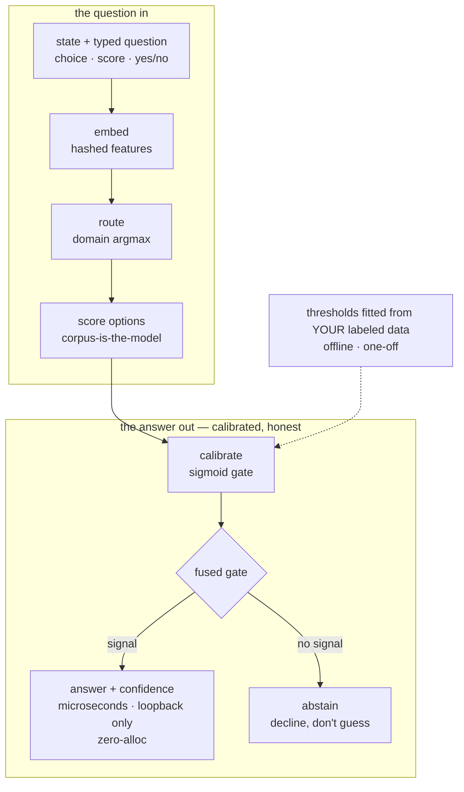
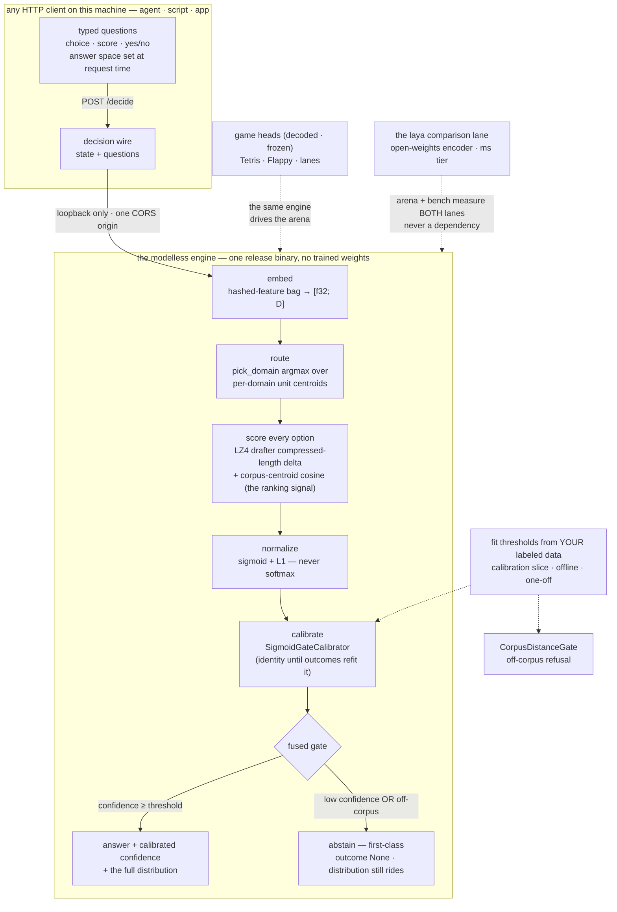

# Decision flow — the one diagram (hero + annotated)

> **Purpose:** the one diagram that shows what Reflex IS end to end — a
> typed-decision engine that answers on your machine: state + question in,
> a calibrated answer or an honest abstain out, microseconds, loopback
> only. The compact source below renders `decision_flow.svg`, the hero
> figure the website embeds under the fold (`reflex-site/assets/`).

Two renders exist:

- **The hero SVG** — `decision_flow.svg`, rendered from the COMPACT
  source below (short labels: it must read at landing-page scale on
  `reflex.gist.rs`).
- **The annotated diagram** — the full mermaid in this doc, with the
  honest edge-by-edge reading. The source of truth for what the engine
  actually does (`crates/../src/engine.rs` module doc is the code-level
  authority; this doc is the picture).

## The compact hero source (renders `decision_flow.svg`)

Two LR bands, the flywheel shape: the question in on top, the answer
out under it, the fit loop dotted underneath.

## The annotated source (full detail)

## What each edge means (honest reading)

- **embed → route → score is the modelless path** — no neural weights,
  no AI service. The corpus IS the model: each domain expert owns a
  document corpus, an LZ4 drafter over it, and a centroid. Scoring is
  two signals blended: the drafter's compressed-length delta (bytes the
  option adds to the context) and the query's cosine to the option's
  corpus centroid — the cosine is the signal that actually ranks
  options (the degenerate-lane lesson: a 4-byte option string never
  moves a ~300-byte context's compressed length alone).
- **calibrate is identity until it isn't.** The `SigmoidGateCalibrator`
  starts bit-identical to the raw readout and only refits from outcome
  evidence YOU fit from your labeled data (the dotted edge). No
  telemetry feeds it — the fit is offline, one-off, yours.
- **decide is a FUSED gate, and abstain is a first-class answer.** Low
  calibrated confidence OR an off-corpus state (the
  `CorpusDistanceGate`) yields outcome `None` — the engine declines
  instead of guessing, and the full distribution still rides the wire
  for risk–coverage analysis. Abstention is a routing decision for the
  caller (fallback path), not an error.
- **loopback only, one origin.** The serve edge listens on
  `127.0.0.1:7331` and answers browser calls only from origins you
  allow (`RIIR_REFLEX_ALLOWED_ORIGIN`, default CLOSED — no ACAO). No
  telemetry, no phone-home; the browser cannot reach the engine until
  you open the door for exactly one origin.
- **zero-alloc core.** `solve_into` is fixed-size arrays +
  caller-owned scratch end to end (the G4 gate counts, with a canary
  proving the counter live). Wire materialization allocates by design —
  that is the boundary, not the hot path.
- **dotted edges name the neighbors, never dependencies.** The game
  heads (the arena's Tetris/Flappy/lanes) and the laya comparison lane
  are consumers/measurements AROUND the engine. The bench page measures
  both lanes on byte-identical questions and publishes the losses; the
  laya lane is never a dependency of the decision path.

## Degenerate states (all honest)

- Unfitted calibrator → confidence is the raw readout (bit-identical
  cold start); the fused gate still abstains on the score and distance
  thresholds you configured.
- No fitted thresholds at all → the engine answers with the shipped
  defaults; the harness prints a `threshold_recommendation` per suite
  instead of pretending they are universal.
- Off-corpus state → abstain. That is the designed answer, not a
  failure.

## Re-rendering the hero SVG

The SVG is rendered from the COMPACT source above with mermaid.ink
(JSON-state URL), theme `base` with the site's dark palette —
`primaryColor #241410` node fill, `#ff8a4c` ember borders,
`#f2e6dd` text, `#b99f8f` lines, `#1d110c` clusters on a TRANSPARENT
background (the site's surfaces are `#140b08`/`#1d110c`; transparent
lets one render sit on both) — then post-processed per the Issue-131
conventions: every `@import` stripped, every CSS selector scoped to
`#mermaid-svg`, `role="img"` + an explicit `aria-label` sentence. The
doc block is the source of truth — re-render from it, never hand-edit
the SVG.

**The mirror law (the Issue-131/132 one):** re-render HERE, then copy
the result over `../reflex-site/assets/decision_flow.svg` in the SAME
commit as this doc — the site embeds the bytes, the doc owns the
source, and the two must move together.

## Refs

- `src/engine.rs` module doc — the code-level pipeline authority
- `src/serve.rs` — the loopback edge + the CORS allow-list seam
- katgpt-rs Plan 603 / Proposal 014 — where the engine comes from
- `../reflex-site/` — the site that embeds the hero mirror
- Pattern siblings: `../riir-clippy/.docs/10_self_evolve/self_evolve_flow.md`
  and `../riir-clippy/.docs/01_orientation/role_flows.md` (the
  doc-first → SVG → site-embed pattern this file follows)
