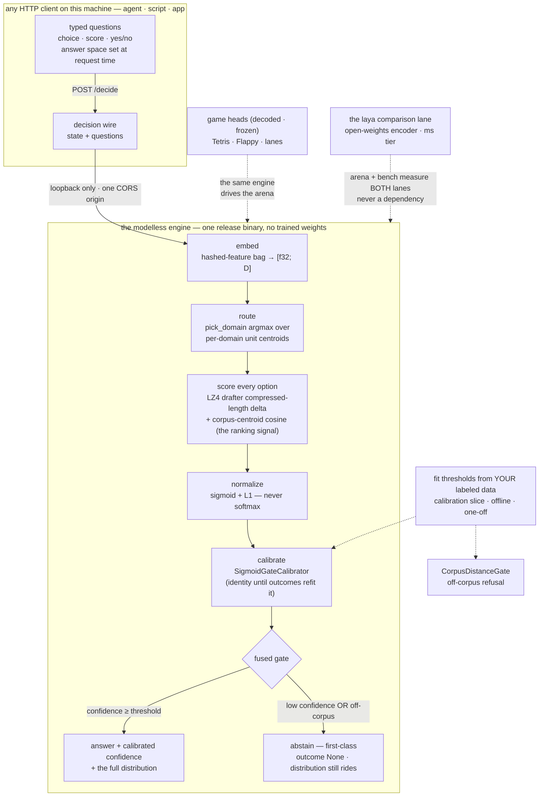

# Decision flow — the one diagram (hero + annotated)

> **Purpose:** the one diagram that shows what Reflex IS end to end — a
> typed-decision engine that answers on your machine: state + question in,
> a calibrated answer or an honest abstain out, microseconds, loopback
> only. The compact source below renders `decision_flow.svg`, the hero
> figure the website embeds under the fold (`reflex-site/assets/`).

Two renders exist:

- **The hero SVG** — `decision_flow.svg` (+ the 390 px card list `decision_flow_m.svg`,
  + the step-through `decision_flow.walk.json`), rendered from the
  ` ```gfflow ` block below (short labels: it must read at
  landing-page scale on `reflex.gist.rs`). The family flow-figure shape:
  numbered steps in path order (branch alternatives share a number with
  letters), grouped into swimlanes — the reference figure is the Reflex ↔
  Reflexer relation flow (design guide §8, riir-ai Plan 620).
- **The annotated diagram** — the full mermaid in this doc, with the
  honest edge-by-edge reading. The source of truth for what the engine
  actually does (`crates/../src/engine.rs` module doc is the code-level
  authority; this doc is the picture).

## The hero source (renders `decision_flow.svg`) — the gfflow block

Four lanes group the stages: your machine (the question in, the fit
loop), the modelless engine, and the two outcomes — answered and
abstained. The main path counts 1→5; the calibrated gate's two outcomes
share 5 (`5a` answers, `5b` abstains); the offline threshold fit is step
6 looping back to the calibrator (a back edge never consumes a number).

```gfflow
file  = "decision_flow.svg"
title = "Reflex: the decision flow — state in, calibrated answer or honest abstain out"
accent = "reflex"

[[lane]]
id = "you"; label = "Your machine"; note = "private · free · loopback only"; color = "reflex"
[[lane]]
id = "eng"; label = "The modelless engine"; note = "corpus-is-the-model · no training run"; color = "reflex"
[[lane]]
id = "ans"; label = "Answered"; note = "calibrated · microseconds"; color = "reflex"
[[lane]]
id = "abst"; label = "Abstained"; note = "a designed output, never an error"; color = "reflex"

[[step]]
id = "ask"; n = "1"; lane = "you"; col = 0
title = "Your question"; body = "a state plus typed questions — choice, score or yes-no"
status = "live"
[[step]]
id = "emb"; n = "2"; lane = "eng"; col = 1
title = "Embed + route"; body = "hashed features; the domain argmax picks your corpus"
status = "live"
[[step]]
id = "score"; n = "3"; lane = "eng"; col = 2
title = "Score every option"; body = "corpus-is-the-model — drafter + centroid cosine"
status = "live"
[[step]]
id = "cal"; n = "4"; lane = "eng"; col = 3
title = "Calibrate"; body = "a sigmoid gate turns the signal into confidence"
status = "live"
[[step]]
id = "yes"; n = "5a"; lane = "ans"; col = 4
title = "Answer"; body = "one pick per question + calibrated confidence"
status = "live"
[[step]]
id = "no"; n = "5b"; lane = "abst"; col = 4
title = "Abstain"; body = "decline, don't guess — the full distribution still rides"
status = "live"
[[step]]
id = "fit"; n = "6"; lane = "you"; col = 5
title = "Refit the gate"; body = "offline, one-off, from your labeled data"
status = "live"

[[edge]]
from = "ask"; to = "emb"
[[edge]]
from = "emb"; to = "score"
[[edge]]
from = "score"; to = "cal"
[[edge]]
from = "cal"; to = "yes"; label = "signal"
[[edge]]
from = "cal"; to = "no"; label = "no signal → off-corpus"
[[edge]]
from = "fit"; to = "cal"; back = true; label = "your data only"

[[walk]]
title = "You ask"
text  = "Your app sends a state plus typed questions over loopback — choice, score or yes-no. Nothing leaves your machine."
steps = ["ask"]
in    = { lang = "json", src = "data/flows/decision_flow/01_in.json", label = "POST /decide" }
[[walk]]
title = "Embed and route"
text  = "The state is hashed into features and the domain argmax picks your corpus — the corpus IS the model here; no neural weights, no AI service."
steps = ["emb"]
[[walk]]
title = "Score every option"
text  = "Each option is scored against the corpus: the drafter's compressed-length delta blended with the query's cosine to the option's corpus centroid — the cosine is the signal that ranks."
steps = ["score"]
[[walk]]
title = "Calibrate"
text  = "A sigmoid gate turns the signal into confidence. The calibrator starts bit-identical to the raw readout and refits only from outcome evidence you supply — offline, one-off, yours."
steps = ["cal"]
[[walk]]
title = "Signal — the answer"
text  = "With signal, one pick per question goes back with calibrated confidence and the full distribution riding beside it. This game-head question is one the engine is sure on."
steps = ["yes"]
in    = { lang = "json", src = "data/flows/decision_flow/01_in.json", label = "POST /decide" }
out   = { lang = "json", src = "data/flows/decision_flow/05a_out.json", label = "sure: outcome yes" }
[[walk]]
title = "No signal — the honest abstain"
text  = "Off-corpus or low confidence yields outcome null: the engine declines instead of guessing, and the full distribution still rides for risk-coverage analysis. This kitchen question is nowhere near the corpus — the distance gate catches it."
steps = ["no"]
in    = { lang = "json", src = "data/flows/decision_flow/05b_in.json", label = "POST /decide · off-corpus" }
out   = { lang = "json", src = "data/flows/decision_flow/05b_out.json", label = "not sure: outcome null" }
[[walk]]
title = "Refit from your data"
text  = "Thresholds are fitted offline from labeled outcomes — never telemetry. The feedback wire is where outcome labels come back: report whether a past answer was right, and the engine recalibrates once it has enough reports."
steps = ["fit"]
in    = { lang = "json", src = "data/flows/decision_flow/06_in.json", label = "POST /feedback · an outcome label" }
out   = { lang = "json", src = "data/flows/decision_flow/06_out.json", label = "not enough reports yet — no refit" }
```

## The annotated source (full detail)


```mermaid
flowchart TB
    subgraph CLIENT["any HTTP client on this machine — agent · script · app"]
        direction LR
        Q["typed questions<br/>choice · score · yes/no<br/>answer space set at request time"] -->|"POST /decide"| WIRE["decision wire<br/>state + questions"]
    end

    WIRE -->|"loopback only · one CORS origin"| EMB

    subgraph ENGINE["the modelless engine — one release binary, no trained weights"]
        direction LR
        EMB["embed<br/>hashed-feature bag → [f32; D]"] --> ROUTE["route<br/>pick_domain argmax over<br/>per-domain unit centroids"]
        ROUTE --> SCORE["score every option<br/>LZ4 drafter compressed-length delta<br/>+ corpus-centroid cosine (the ranking signal)"]
        SCORE --> NORM["normalize<br/>sigmoid + L1 — never softmax"]
        NORM --> CAL["calibrate<br/>SigmoidGateCalibrator<br/>(identity until outcomes refit it)"]
        CAL --> DEC{"fused gate"}
        DEC -->|"confidence ≥ threshold"| ANS["answer + calibrated confidence<br/>+ the full distribution"]
        DEC -->|"low confidence OR off-corpus"| ABST["abstain — first-class<br/>outcome None · distribution still rides"]
    end

    FIT["fit thresholds from YOUR labeled data<br/>calibration slice · offline · one-off"] -.-> CAL
    FIT -.-> DIST["CorpusDistanceGate<br/>off-corpus refusal"]

    HEADS["game heads (decoded · frozen)<br/>Tetris · Flappy · lanes"] -.->|"the same engine<br/>drives the arena"| ENGINE
    LANE["the laya comparison lane<br/>open-weights encoder · ms tier"] -.->|"arena + bench measure BOTH lanes<br/>never a dependency"| ENGINE
```

## What each edge means (honest reading)

- **embed → route → score is the modelless path** — no neural weights,
  no AI service. The corpus IS the model: each domain expert owns a
  document corpus, an LZ4 drafter over it, and a centroid. Scoring is
  two signals blended: the drafter's compressed-length delta (bytes the
  option adds to the context) and the query's cosine to the option's
  corpus centroid — the cosine is the signal that actually ranks
  options (the degenerate-lane lesson: a 4-byte option string never
  moves a ~300-byte context's compressed length alone).
- **calibrate is identity until it isn't.** The `SigmoidGateCalibrator`
  starts bit-identical to the raw readout and only refits from outcome
  evidence YOU fit from your labeled data (the dotted edge). No
  telemetry feeds it — the fit is offline, one-off, yours.
- **decide is a FUSED gate, and abstain is a first-class answer.** Low
  calibrated confidence OR an off-corpus state (the
  `CorpusDistanceGate`) yields outcome `None` — the engine declines
  instead of guessing, and the full distribution still rides the wire
  for risk–coverage analysis. Abstention is a routing decision for the
  caller (fallback path), not an error.
- **loopback only, one origin.** The serve edge listens on
  `127.0.0.1:7331` and answers browser calls only from origins you
  allow (`RIIR_REFLEX_ALLOWED_ORIGIN`, default CLOSED — no ACAO). No
  telemetry, no phone-home; the browser cannot reach the engine until
  you open the door for exactly one origin.
- **zero-alloc core.** `solve_into` is fixed-size arrays +
  caller-owned scratch end to end (the G4 gate counts, with a canary
  proving the counter live). Wire materialization allocates by design —
  that is the boundary, not the hot path.
- **dotted edges name the neighbors, never dependencies.** The game
  heads (the arena's Tetris/Flappy/lanes) and the laya comparison lane
  are consumers/measurements AROUND the engine. The bench page measures
  both lanes on byte-identical questions and publishes the losses; the
  laya lane is never a dependency of the decision path.

## Degenerate states (all honest)

- Unfitted calibrator → confidence is the raw readout (bit-identical
  cold start); the fused gate still abstains on the score and distance
  thresholds you configured.
- No fitted thresholds at all → the engine answers with the shipped
  defaults; the harness prints a `threshold_recommendation` per suite
  instead of pretending they are universal.
- Off-corpus state → abstain. That is the designed answer, not a
  failure.

## Re-rendering the hero SVG

The SVGs are rendered from the ` ```gfflow ` block above by reflex-site's
`scripts/render_flows.py`, which writes BOTH mirrors in one run — this
directory's `decision_flow.svg` + `decision_flow_m.svg` and
`reflex-site/assets/decision_flow.svg` + `_m`. Palette: the gist.rs web
family tokens (riir-ai `.docs/13_web_family/family.css`, adopted
2026-10-03), the Reflex orange lane accents, transparent-safe `--bg-2`
figure ground; the root `<svg>` carries `data-gfflow="1"`, `role="img"`,
`<title>` and a generated `<desc>`. The doc block is the source of truth
— re-render from it, never hand-edit the SVGs.

**The mirror law (the Issue-131/132 one):** re-render with the reflex-site
script (it writes both copies byte-identically), and commit this doc + its
SVG together — the site embeds the bytes, the doc owns the
source, and the two must move together.

## Refs

- `src/engine.rs` module doc — the code-level pipeline authority
- `src/serve.rs` — the loopback edge + the CORS allow-list seam
- katgpt-rs Plan 603 / Proposal 014 — where the engine comes from
- `../reflex-site/` — the site that embeds the hero mirror
- Pattern siblings: `../riir-refine/.docs/10_self_evolve/self_evolve_flow.md`
  and `../riir-refine/.docs/01_orientation/role_flows.md` (the
  doc-first → SVG → site-embed pattern this file follows)
