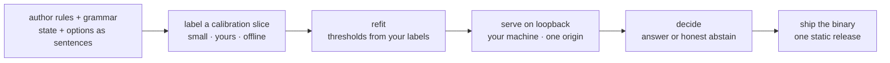

# Dev flow — build a Reflex lane

> **Purpose:** the development loop for a Reflex decision lane — author
> rules/grammar (the tetris-head pattern: state + options as closed-grammar
> sentences), label a small calibration slice, refit the thresholds, serve
> on loopback, ship the binary. The compact source below renders
> `dev_flow.svg` for the site's `/resources` education page (ai Proposal
> 053); this doc block is the source of truth — re-render from it, never
> hand-edit the SVG.

## The compact source (renders `dev_flow.svg`)

## What each step means

- **author rules + grammar** — write the domain as sentences: a state
  sentence and option sentences in a closed grammar (the tetris-head
  pattern). The grammar bounds what can be asked; nothing outside it is
  ever answered.
- **label a calibration slice** — a small set of your own labeled examples,
  kept offline. This is the only data the fit consumes.
- **refit** — fit the gate thresholds from your labels, offline, one-off.
  No telemetry feeds this step; the calibrator stays bit-identical until
  you refit it.
- **serve on loopback** — run the edge on your machine with one allowed
  origin. Answers are microsecond-class; abstains are a designed output.
- **decide** — the live path: an answer with calibrated confidence, or an
  honest abstain when the evidence is thin.
- **ship the binary** — one static release per platform; the corpus and the
  fitted thresholds ride with it.

## Rendering

The SVG is rendered centrally from the fenced block above —
`reflex-site/scripts/render_tetris_flows.py` scans every mermaid block
carrying `%% file:` and `%% aria:` headers and renders the named file. Edit
the block here; never hand-edit the rendered SVG. The rendered `dev_flow.svg`
is committed BESIDE this doc (the same both-mirrors law as
`03_decision_flow/`: doc-adjacent copy + the site's
`assets/reflex_dev_flow.svg`, byte-identical), and `scripts/sync_mirror.py --check`
in reflex-site is the drift detector between renders.
