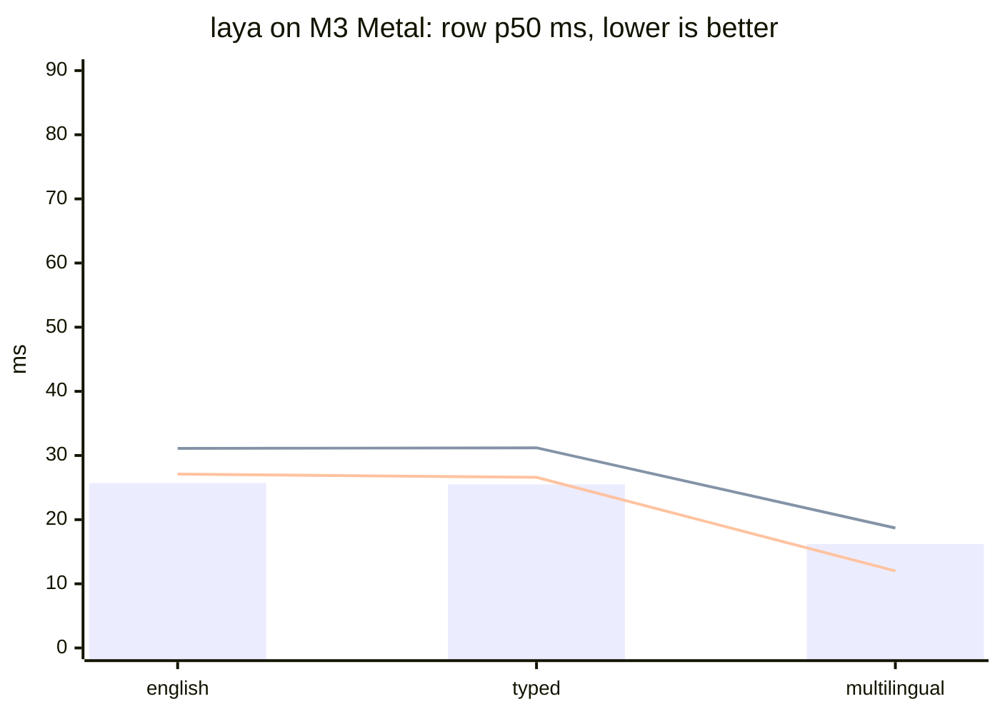

# riir-reflex

Decision-engine serving + comparison + contribution — the Proposal 014
Phase 1 deliverable (Plan 603). Open source under the Research 003
amendment (the sanctioned exception, owner directive 2026-09-22); MIT.

**Status (2026-09-22): Phase 1 COMPLETE** — T1.1–T1.8 all landed. The
engine serves typed decisions (`choice` / `score` / `noul`, abstention
first-class) over the LANDED katgpt-rs substrate; the laya lane runs
native-Rust under the G5 parity gate (88/88 forwards, top-1 agreement 1.000,
probability drift ≤ 3.1e-6); the Phase-1 harness produces the honest
per-task tables over BOTH lanes (T1.5).

## Quick start

```sh
cargo run --release --bin reflex                # the localhost decision engine
cargo run --release --bin harness              # the benchmark tables (T1.5)
cargo test                                     # the gates
```

- HTTP edge: `/decide`, `/feedback`, `/healthz` — one std-only binary, no
  daemon framework.
- The harness needs the datasets (`.raw/datasets/`,
  `scripts/fetch_datasets.sh`) and, for the laya lane, `--features
  laya-riir` with the weights root (`LAYA_WEIGHTS_DIR` or the default
  cache; weights download + SHA-256 verify on first use).
- `harness --laya-python` ADDS the original torch reference as a
  measurement-only subprocess oracle lane (needs python3 + torch/
  transformers; the published tables carry both `laya (rust)` and
  `laya (python)` — issue 012).

## Install (binary-only distribution, Plan 606)

Public releases live at [`gist-rs/reflex`](https://github.com/gist-rs/reflex)
(this source repo is public under the same amendment — the dist repo stays
the binary-only install surface); the homebrew tap and scoop
bucket carry the same archives — the FULL cargo-heal-matching matrix:
macOS aarch64 + x86_64 · linux musl x86_64 + aarch64 · windows
x86_64-pc-windows-gnu. The shipped feature set is `modelless + laya-riir`
(since v0.2.0, the candle-free cut — the candle reference lane was removed
entirely) with the darwin artifacts adding `laya-riir-metal` (since v0.2.2,
the Metal-default watchability lane) — the comparison lane rides the
binary, its model weights do NOT ride the archives (runtime HF download,
SHA-256-verified, cached under `~/.cache/riir-reflex/laya`). The installed
COMMAND is `reflex` (v0.2.2 rename; the formula/scoop/package names stay
`riir-reflex`).

```sh
# macOS / Linux
curl -fsSL https://raw.githubusercontent.com/gist-rs/reflex/main/install.sh | sh

# Windows (PowerShell)
iwr -useb https://raw.githubusercontent.com/gist-rs/reflex/main/install.ps1 | iex

# Homebrew (macOS / Linux)
brew tap gist-rs/tap && brew install riir-reflex

# Scoop (Windows)
scoop bucket add gist-rs https://github.com/gist-rs/scoop-bucket && scoop install riir-reflex
```

Run it (bare invocation = serve, loopback 7331):

```sh
reflex                            # closed posture — no browser page can reach it
RIIR_REFLEX_ALLOWED_ORIGIN=https://reflex.gist.rs reflex
                                  # opens the engine to exactly the arena playground
reflex --version                  # build stamp: version + compiled feature set
```

CORS is CLOSED by default: no `Access-Control-Allow-Origin` header is ever
emitted unless `RIIR_REFLEX_ALLOWED_ORIGIN` names the origin(s) allowed to
call the engine from a browser. `cargo-heal`-style staleness guard: a
binary built without the full release set says so on `--version`
(`release set: STALE — missing …` + the rebuild command).

### The laya lane over HTTP (opt-in)

The comparison lane is compiled into the release binary but OFF at runtime.
Start with `RIIR_REFLEX_LAYA=1` and the english checkpoint loads in a
background thread at boot (first start downloads ~650 MB from HF,
SHA-256-verified, cached under `~/.cache/riir-reflex/laya`); `/healthz`
reports `lanes: {modelless, laya}` with the laya state `off | loading |
ready | failed`.

`/decide` accepts an `X-Reflex-Lane: laya` header. The lane is served by
the same G5-parity forward the benches measure, through a one-thread actor
(the `RiirAgent` backend is `!Send`; forwards serialize — one model, one
forward at a time). Every non-ready state answers FAIL-CLOSED (`503` naming
`RIIR_REFLEX_LAYA=1`, `503 loading`, `500` with the load failure) — never a
silent modelless fallback, because a silently-served wrong lane would poison
the arena's per-lane claims. Responses carry `routing.lane: "laya"` + the
applied temperature in `calibration`. This is what powers the live games at
[reflex.gist.rs/arena](https://reflex.gist.rs/arena/).

The device is Metal on macOS metal builds by default (v0.2.2 — the measured
~2× per-forward gain; `LAYA_DEVICE=cpu` opts out, an explicit env value is
always honored verbatim).

### The fitted game heads (Tetris + lanes + flappy, default-on)

The modelless lane answers Plan 607's three game questions from the
**decoded corpus-fitted heads** — boot-fitted from verbatim BLAKE3-pinned
copies of the katgpt-rs oracle fixtures (each head's published fit is
asserted in `tests/game_heads_serve.rs` — no serving from an unmeasured
fit):

| head | published fit | request shape |
|---|---|---|
| Tetris | Bench 881: λ=1, 44/120 · 44/120 | `state` = the spot sentence |
| Lanes | Bench 880 (lossless): λ=0.01, 84/100 · 84/100, digest `7d3f1d8e…09d34` | joined-state turn: `state` = the three lane sentences ONE PER LINE, exactly three noul questions — answer i is lane i |
| Flappy | Bench 882 v3: λ=1, 96/100 · 96/100, digest `c93d36dc…e3c5` | (state, option) pair: `state` = the state sentence + the option sentence (two lines), one noul question |

The heads serve BEFORE the cosine engine falls through: grammar-invalid
states, foreign questions and non-noul kinds all decline to the honest
abstain. `noul` questions legally carry no options, so the sentence
sequence rides in the `state` field one per line. This is what makes the
arena's three modelless boards play out of the box against a local engine
(issue 011 closed; the wasm in-tab heads play even with no engine).

Release builds on this box (manual, Plan-105 posture; non-host triples
route through cargo-zigbuild):

```sh
scripts/build-release.sh --licenses              # regenerate THIRD_PARTY_LICENSES.md
scripts/build-release.sh aarch64-apple-darwin    # dist profile (strip + fat LTO)
scripts/build-release.sh x86_64-pc-windows-gnu   # cross target → zip via cargo-zigbuild
scripts/binary_leak_scan.sh target/aarch64-apple-darwin/dist/reflex
```

## The gates (Plan 603 GOAT)

| gate | verdict | where |
|---|---|---|
| G1 calibration (beats raw + conformal-naive floor) | PASS 7/14 · FAIL 2 (ag_news, massive_intent) · NO CLAIM 5 (the synthetic families — their cal windows sit below the calibrator's 64-obs fit floor, so no calibration claim is made; reported NO CLAIM since `bb2370a`, matching the calibration_protocol promise, never a FAIL) | `.benchmarks/001_phase1_tables/TABLES.md` |
| G2 latency (p99 ≤ 1 ms per decision set) | PASS — p99 0.06 ms per 8-question set | `benches/decision_set_goat.rs` |
| G3 no regression | PASS — consumes katgpt-rs, never edits it | boundary gate |
| G4 alloc (hot path alloc-free, canary-armed) | PASS — 0 allocs post-warmup | `benches/decision_set_goat.rs` |
| G5 laya parity (≥ 99.9% top-1, ≤ 1e-3 drift) | PASS — 88/88, 1.000, ≤ 3.1e-6 | `tests/laya_riir_parity.rs` (the riir lane — the lane's ONLY gate since the candle removal, `.issues/006`; the deleted candle twin's row is history) |

## Results (Phase-1 harness, 2026-09-23 — the 15-suite tables, both laya
## backends: rust (metal) + the python reference (mps), issue 012)

Full tables: [`TABLES.md`](.benchmarks/001_phase1_tables/TABLES.md)
(regenerated by `.github/workflows/harness_tables.yml` — never hand-typed);
record: [`001_phase1_harness.md`](.benchmarks/001_phase1_harness.md).
Protocol + divergences: [`laya_bench_protocols.md`](.docs/laya_bench_protocols.md),
[`dataset_manifest.md`](.docs/dataset_manifest.md).

Headline (accuracy per suite; modelless vs the BEST laya checkpoint;
accuracy is bit-identical across the 09-23 runs — deterministic lanes —
and the latency rows are the committed 18:09Z refresh run `83173e5`;
the laya latency columns are stale-by-progress — the riir Metal lane has
since climbed the kernel ladder (`374d9af` → `4ef290c` → `a51ea42`), see
the three-way table below for the current rows):

| suite | n | modelless | laya best | modelless p50 | laya p50 |
|---|---|---|---|---|---|
| typed_decisions | 2000 | 0.3190 | **0.7445** (`typed`) | 0.5 ms | 1312 ms |
| ag_news | 400 | 0.5100 | **0.9500** | 0.2 ms | 116 ms |
| emotion | 400 | 0.2825 | **0.5925** | 0.1 ms | 66 ms |
| sst5 | 600 | 0.2167 | **0.3717** | 0.1 ms | 88 ms |
| prompt_injections | 116 | 0.4397 | **0.6983** | 0.1 ms | 88 ms |
| xnli_en | 300 | 0.3467 | **0.8600** | 0.1 ms | 99 ms |
| massive_intent_en | 300 | 0.0767 | **0.7500** | 0.1 ms | 159 ms |
| banking77 | 500 | 0.4460 | **0.4980** | 0.3 ms | 249 ms |
| code_fixtures | 28 | 0.2143 | **0.5357** | 0.1 ms | 296 ms |

Protocol validation: the port reproduces the reference's published numbers
within noise — ag_news 0.9500 vs 0.953, emotion 0.5925 vs 0.600,
typed_decisions[typed] 0.7445 vs 0.766, base checkpoints 0.3575/0.3490 vs
"~0.36, below the 0.461 majority baseline".

typed-decisions extras (the specialist's own axis, calibrated probs): laya·typed
soft_acc 0.4668 · brier_soft 0.0677 · score MAE 0.2424 · within_1 0.995 — vs
modelless soft_acc 0.3168 · brier_soft 0.2436 · MAE 0.7272 · within_1 0.724.

**Same-box latency, all-Metal three-way (M3, the G5 fixture corpus, same-session interleaved — Bench 001 addendum 4; riir column re-measured 2026-09-24 after the narrow-BK64 + xwide pass `a51ea42`):**

| checkpoint | python torch MPS (row p50) | rust candle Metal (row p50) | rust riir Metal (row p50, candle-free) |
|---|---|---|---|
| english | 25.7 ms | 31.1 ms | **26.9–27.4 ms** (~parity, 1.05×) |
| typed | 25.5 ms | 31.2 ms | 26.2–27.1 ms (~parity, 1.05×) |
| multilingual | 16.2 ms | 18.7 ms | **11.9–12.2 ms** (riir wins) |

Suite p50s (position-balanced interleaved A/B vs the pre-pass tree, 2026-09-24):
ag_news 34→29 ms (−15%, **riir beats the python oracle's 36**), fixtures
above, banking77 88/89 → 85/86 ms (−3%; the python oracle's 70 stays
1.2× ahead — in-kernel sgemm efficiency at seq ~317 is the residual).

The fair compare the owner asked for — every lane on the same GPU
(`.issues/005`). v1 (one 16×16-tiled GEMM + per-op command buffers) landed
~2.5× behind candle; the kernel ladder then closed it: ONE pass-scoped
command buffer (commit at the three host reads + a 1024-encode pipeline
flush), ALL-heads batched attention (one dispatch per op instead of one per
head), a simdgroup GEMM (32×32 tile, 16 simdgroups/threadgroup, coalesced
staging incl. the Wᵀ/Kᵀ shapes, guarded edge stores), and row-parallel
softmax/LN (one simdgroup per row) → 28.3/28.1/12.6 ms; the two-instance
sgemm (`4ef290c`: a 32×64 narrow + a 64×64 wide kernel — row-twin and
column-twin accumulator shapes, two staged tiles per threadgroup, picked
by `m ≥ 256`) held english/typed and moved multilingual → 28.3/28.3/12.2 ms.
A flash-attention-style fused kernel was BUILT, MEASURED, and REVERTED the
same day: at the lane's real sequence lengths (fixture p50 ~100 tokens,
banking77 p50 ~317) the materialized score parent costs only ~3 ms of an
86 ms forward while the fused form's K/V re-reads (⌈seq/BQ⌉×) outweigh it
below BQ=32 — the geometry worth reviving if a long-sequence workload ever
makes attention the term that matters. The next rung (`a51ea42`, 2026-09-24):
narrow BK 32→64 (halves the k-loop's barrier count; fixtures/ag_news
−7..−15%) + a THIRD instance, xwide (64×128×32, four accumulators per
simdgroup, staging-intensity axis 32→42.7 MAC/staged-element) picked at
`m ≥ 256 && n ≥ 2048` — the n floor is MEASURED: at n = 1024 the 64×128
tiles yield only 40 threadgroups at seq ~317 (one per GPU core, no
over-subscription) and banking77 regressed before the floor went in.
Measurement trap recorded: the first banking77 A/B read 95→80 ms (−16%)
but base ran first in every round — a cold-GPU artifact; position-balanced
pairs put the true xwide gain at −3% (88/89 → 85/86) and the deepest-quiet
window reads both at 80.0 (integer-ms resolution). G5 parity green at BOTH
postures throughout (the CPU lane is bit-identical).



(bar = torch MPS · dashed line 1 = candle Metal · dashed line 2 = riir
Metal at `a51ea42` — the fixture-corpus p50 midpoints of the 09-24
re-measurement. The earlier CPU-v1 column — 188.7/201.0/91.8 ms against
two GPU lanes — was a device-mismatched chart; retracted in Bench 001
addendum 3, the CPU numbers stay on record as the v1 baseline.)

**The candle column is FROZEN HISTORY** (`.issues/006` T6, 2026-09-22):
the candle lane was removed from this repo the day after this chart was
taken — its column can never be re-measured here and stays as the recorded
baseline the riir Metal optimization ladder measures against. The riir
column is the live one.

Honest verdict: **torch MPS is ~1.2–1.5× faster than candle Metal; the
riir Metal lane has now closed candle and sits at ~1.0–1.05× of torch on
the fixture corpus, BEATS torch on multilingual (0.74×) and ag_news
(0.81×), and trails only on banking77 (1.2×)** — the same function in
all lanes (G5 parity green at every posture), the remaining gaps are
in-kernel sgemm efficiency at seq ~317, and the wins are also deployment:
no Python, no torch, no candle — one candle-free binary with its own MSL
kernels.
(A first version of this section claimed the port faster — a cross-session
artifact where the python side ran under box load; the interleaved A/B
above is the verdict, and the retraction is recorded in Bench 001.)

## Honest reading (the losses are the point)

- **The modelless lane is corpus-bound by design**: near-chance to
  well-below-laya on out-of-domain text classification (ag_news 0.510 vs
  0.950, massive 0.077 vs 0.750) — the zero-shot breadth loss is
  structural, not a bug (plan caveat 4). banking77 is the near-parity
  exception (0.446 vs 0.498) since the option-rank blend (Issue 004 T7).
  Its native territory (typed decision sets over workflow states, code
  spans) is where the substrate is meant to live. Its G1 calibration
  reads 7 PASS / 2 FAIL / 5 NO CLAIM in the current tables: where the
  scorer carries no signal, confidence honestly collapses to the base
  rate and beats the conformal-naive floor.
- **The laya lane is the accuracy heavyweight** (pretrained 421M/322M
  encoders) at ~10³–10⁴× the per-decision latency and ~10⁹× the
  parameters. The arena exists to make that trade visible, not to hide it.
- **Abstention works**: on suites where the calibrator learns "no signal",
  the engine abstains everything instead of guessing (the wire's
  first-class abstention doing its job). The fused-gate thresholds are
  FITTED per suite at the cal-slice 30th percentile — the birth constants
  measurably do not transfer (they abstained 100% everywhere).
- **Known artifact**: a row whose calibrated confidence collapses to
  exactly 0.0 (the "always wrong" fit) reports readout-ECE 0.000 because
  the protocol's ECE bins are left-open `(0,1]` — zero-confidence rows
  fall in NO bin. Read those rows' ECE as "n/a", not "perfect".

## Documentation

- `AGENTS.md` — repo context, boundary, gates.
- `BOUNDARY.md` — the one-code-level-dep contract.
- `.docs/laya_reference_pin.md` — the laya provenance + port record (G5).
- `.docs/laya_bench_protocols.md` — the benchmark task protocols (port spec).
- `.docs/dataset_manifest.md` — fetched datasets, blake3 digests, verified
  ClassLabel orders, gaps.
- `.docs/sibling_layout.md` — the dependency-graph artifact.

## Disclaimers + attribution

- Not affiliated with, or endorsed by, TypeSafe AI. **Jev is their
  product**, named only to compare against (the laya-site idiom).
- The **laya** comparison lane loads Apache-2.0-licensed model checkpoints
  (ModernBERT-large, mmBERT-base + the mask-scoring head and Router) from
  the brainfunctioncollapse laya Hugging Face repos at runtime — unmodified,
  SHA-256-verified, never redistributed in the release archives. Their
  Apache-2.0 license governs those artifacts; attribution is repeated in
  every release archive's `THIRD_PARTY_LICENSES.md` header.
- All site copy, benchmarks, and code are original. The arena SHAPE
  (playground + measured benchmark + agent-skill download) is an
  unprotectable concept; nothing else is replicated.
