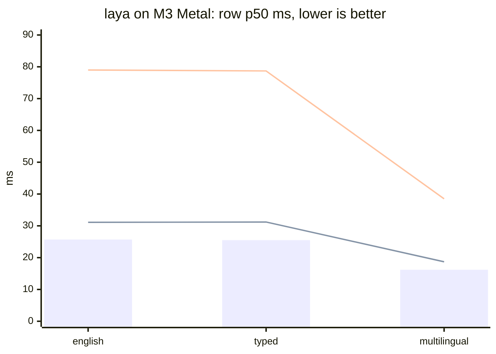

# riir-reflex

Decision-engine serving + comparison + contribution — the Proposal 014
Phase 1 deliverable (Plan 603). Open source under the Research 003
amendment (the sanctioned exception, owner directive 2026-09-22); MIT.

**Status (2026-09-22): Phase 1 COMPLETE** — T1.1–T1.8 all landed. The
engine serves typed decisions (`choice` / `score` / `noul`, abstention
first-class) over the LANDED katgpt-rs substrate; the laya lane runs
native-Rust under the G5 parity gate (88/88 forwards, top-1 agreement 1.000,
probability drift ≤ 3.1e-6); the Phase-1 harness produces the honest
per-task tables over BOTH lanes (T1.5).

## Quick start

```sh
cargo run --release --bin riir-reflex          # the localhost decision engine
cargo run --release --bin harness              # the benchmark tables (T1.5)
cargo test                                     # the gates
```

- HTTP edge: `/decide`, `/feedback`, `/healthz` — one std-only binary, no
  daemon framework.
- The harness needs the datasets (`.raw/datasets/`,
  `scripts/fetch_datasets.sh`) and, for the laya lane, `--features
  laya-riir` with the weights root (`LAYA_WEIGHTS_DIR` or the default
  cache; weights download + SHA-256 verify on first use).

## Install (binary-only distribution, Plan 606)

Public releases live at [`gist-rs/reflex`](https://github.com/gist-rs/reflex)
(this source repo is public under the same amendment — the dist repo stays
the binary-only install surface); the homebrew tap and scoop
bucket carry the same archives — the FULL cargo-heal-matching matrix:
macOS aarch64 + x86_64 · linux musl x86_64 + aarch64 · windows
x86_64-pc-windows-gnu. The shipped feature set is `modelless + laya-riir`
(since v0.2.0, the candle-free cut — the candle reference lane was removed
entirely) — the comparison lane rides the binary, its model weights do NOT
ride the archives (runtime HF download, SHA-256-verified, cached under
`~/.cache/riir-reflex/laya`).

```sh
# macOS / Linux
curl -fsSL https://raw.githubusercontent.com/gist-rs/reflex/main/install.sh | sh

# Windows (PowerShell)
iwr -useb https://raw.githubusercontent.com/gist-rs/reflex/main/install.ps1 | iex

# Homebrew (macOS / Linux)
brew tap gist-rs/tap && brew install riir-reflex

# Scoop (Windows)
scoop bucket add gist-rs https://github.com/gist-rs/scoop-bucket && scoop install riir-reflex
```

Run it (bare invocation = serve, loopback 7331):

```sh
riir-reflex                       # closed posture — no browser page can reach it
RIIR_REFLEX_ALLOWED_ORIGIN=https://reflex.gist.rs riir-reflex
                                  # opens the engine to exactly the arena playground
riir-reflex --version             # build stamp: version + compiled feature set
```

CORS is CLOSED by default: no `Access-Control-Allow-Origin` header is ever
emitted unless `RIIR_REFLEX_ALLOWED_ORIGIN` names the origin(s) allowed to
call the engine from a browser. `cargo-heal`-style staleness guard: a
binary built without the full release set says so on `--version`
(`release set: STALE — missing …` + the rebuild command).

Release builds on this box (manual, Plan-105 posture; non-host triples
route through cargo-zigbuild):

```sh
scripts/build-release.sh --licenses              # regenerate THIRD_PARTY_LICENSES.md
scripts/build-release.sh aarch64-apple-darwin    # dist profile (strip + fat LTO)
scripts/build-release.sh x86_64-pc-windows-gnu   # cross target → zip via cargo-zigbuild
scripts/binary_leak_scan.sh target/aarch64-apple-darwin/dist/riir-reflex
```

## The gates (Plan 603 GOAT)

| gate | verdict | where |
|---|---|---|
| G1 calibration (beats raw + conformal-naive floor) | PASS 8/9 suites (massive_intent_en FAIL — recorded) | `.benchmarks/001_phase1_harness.md` |
| G2 latency (p99 ≤ 1 ms per decision set) | PASS — p99 0.06 ms per 8-question set | `benches/decision_set_goat.rs` |
| G3 no regression | PASS — consumes katgpt-rs, never edits it | boundary gate |
| G4 alloc (hot path alloc-free, canary-armed) | PASS — 0 allocs post-warmup | `benches/decision_set_goat.rs` |
| G5 laya parity (≥ 99.9% top-1, ≤ 1e-3 drift) | PASS — 88/88, 1.000, ≤ 3.1e-6 | `tests/laya_riir_parity.rs` (the riir lane — the lane's ONLY gate since the candle removal, `.issues/006`; the deleted candle twin's row is history) |

## Results (Phase-1 harness, 2026-09-22)

Full tables: [`TABLES.md`](.benchmarks/001_phase1_tables/TABLES.md)
(regenerated by `.github/workflows/harness_tables.yml` — never hand-typed);
record: [`001_phase1_harness.md`](.benchmarks/001_phase1_harness.md).
Protocol + divergences: [`laya_bench_protocols.md`](.docs/laya_bench_protocols.md),
[`dataset_manifest.md`](.docs/dataset_manifest.md).

Headline (accuracy per suite; modelless vs the BEST laya checkpoint):

| suite | n | modelless | laya best | modelless p50 | laya p50 |
|---|---|---|---|---|---|
| typed_decisions | 2000 | 0.2780 | **0.7445** (`typed`) | 0.5 ms | 4493 ms |
| ag_news | 400 | 0.2575 | **0.9500** | 0.2 ms | 388 ms |
| emotion | 400 | 0.2950 | **0.5925** | 0.1 ms | 170 ms |
| sst5 | 600 | 0.1567 | **0.3717** | 0.1 ms | 204 ms |
| prompt_injections | 116 | 0.4828 | **0.6983** | 0.1 ms | 169 ms |
| xnli_en | 300 | 0.3333 | **0.8600** | 0.1 ms | 344 ms |
| massive_intent_en | 300 | 0.0767 | **0.7500** | 0.1 ms | 529 ms |
| banking77 | 500 | 0.0400 | **0.4980** | 0.3 ms | 773 ms |
| code_fixtures | 32 | 0.2500 | **0.5625** | 0.1 ms | 1051 ms |

Protocol validation: the port reproduces the reference's published numbers
within noise — ag_news 0.9500 vs 0.953, emotion 0.5925 vs 0.600,
typed_decisions[typed] 0.7445 vs 0.766, base checkpoints 0.3575/0.3490 vs
"~0.36, below the 0.461 majority baseline".

typed-decisions extras (the specialist's own axis, calibrated probs): laya·typed
soft_acc 0.4668 · brier_soft 0.0677 · score MAE 0.2424 · within_1 0.995 — vs
modelless soft_acc 0.3168 · brier_soft 0.2436 · MAE 0.7272 · within_1 0.724.

**Same-box latency, all-Metal three-way (M3, the G5 fixture corpus, same-session interleaved — Bench 001 addendum 4):**

| checkpoint | python torch MPS (row p50) | rust candle Metal (row p50) | rust riir Metal (row p50, candle-free) |
|---|---|---|---|
| english | **25.7 ms** | 31.1 ms | 79.0 ms |
| typed | **25.5 ms** | 31.2 ms | 78.7 ms |
| multilingual | **16.2 ms** | 18.7 ms | 38.5 ms |

The fair compare the owner asked for — every lane on the same GPU
(`.issues/005`): torch MPS wins every checkpoint, candle Metal follows,
and the riir lane's OWN Metal backend lands ~2.5× behind candle — the
honest naive-kernel v1 baseline (one 16×16-tiled GEMM kernel + per-op
command buffers; candle's MLX simdgroup kernels + fused dispatch are the
measured gap). G5 parity is green at the Metal posture (drift ≤ 6e-6 vs
the 1e-3 gate) — same function, slower kernels, optimize later.



(bar = torch MPS · dashed line 1 = candle Metal · dashed line 2 = riir
Metal. The earlier CPU-v1 column — 188.7/201.0/91.8 ms against two GPU
lanes — was a device-mismatched chart; retracted in Bench 001 addendum 3,
the CPU numbers stay on record as the v1 baseline.)

**The candle column is FROZEN HISTORY** (`.issues/006` T6, 2026-09-22):
the candle lane was removed from this repo the day after this chart was
taken — its column can never be re-measured here and stays as the recorded
baseline the riir Metal optimization ladder measures against. The riir
column is the live one.

Honest verdict: **torch MPS is ~1.2–1.5× faster than candle Metal, and
~3–5× faster than the riir Metal v1** — the same function in all three
(G5 parity green at every posture), and the gaps are kernel maturity
(MPSGraph vs candle's MLX kernels vs our naive v1 tiling), not our
forward code. The riir lane's wins remain deployment: no Python, no
torch, no candle — one candle-free binary with its own MSL kernels.
(A first version of this section claimed the port faster — a cross-session
artifact where the python side ran under box load; the interleaved A/B
above is the verdict, and the retraction is recorded in Bench 001.)

## Honest reading (the losses are the point)

- **The modelless lane is corpus-bound by design**: near-chance on
  out-of-domain text classification (AG News, SST-5, MASSIVE, banking77) —
  the zero-shot breadth loss is structural, not a bug (plan caveat 4). Its
  native territory (typed decision sets over workflow states, code spans)
  is where the substrate is meant to live. Its G1 calibration PASSES 8/9:
  where the scorer carries no signal, confidence honestly collapses to the
  base rate and beats the conformal-naive floor.
- **The laya lane is the accuracy heavyweight** (pretrained 421M/322M
  encoders) at ~10³–10⁴× the per-decision latency and ~10⁹× the
  parameters. The arena exists to make that trade visible, not to hide it.
- **Abstention works**: on suites where the calibrator learns "no signal",
  the engine abstains everything instead of guessing (the wire's
  first-class abstention doing its job). The fused-gate thresholds are
  FITTED per suite at the cal-slice 30th percentile — the birth constants
  measurably do not transfer (they abstained 100% everywhere).
- **Known artifact**: a row whose calibrated confidence collapses to
  exactly 0.0 (the "always wrong" fit) reports readout-ECE 0.000 because
  the protocol's ECE bins are left-open `(0,1]` — zero-confidence rows
  fall in NO bin. Read those rows' ECE as "n/a", not "perfect".

## Documentation

- `AGENTS.md` — repo context, boundary, gates.
- `BOUNDARY.md` — the one-code-level-dep contract.
- `.docs/laya_reference_pin.md` — the laya provenance + port record (G5).
- `.docs/laya_bench_protocols.md` — the benchmark task protocols (port spec).
- `.docs/dataset_manifest.md` — fetched datasets, blake3 digests, verified
  ClassLabel orders, gaps.
- `.docs/sibling_layout.md` — the dependency-graph artifact.

## Disclaimers + attribution

- Not affiliated with, or endorsed by, TypeSafe AI. **Jev is their
  product**, named only to compare against (the laya-site idiom).
- The **laya** comparison lane loads Apache-2.0-licensed model checkpoints
  (ModernBERT-large, mmBERT-base + the mask-scoring head and Router) from
  the brainfunctioncollapse laya Hugging Face repos at runtime — unmodified,
  SHA-256-verified, never redistributed in the release archives. Their
  Apache-2.0 license governs those artifacts; attribution is repeated in
  every release archive's `THIRD_PARTY_LICENSES.md` header.
- All site copy, benchmarks, and code are original. The arena SHAPE
  (playground + measured benchmark + agent-skill download) is an
  unprotectable concept; nothing else is replicated.
