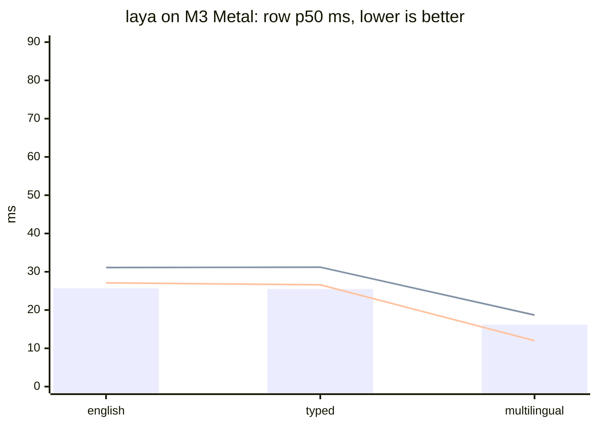

# riir-reflex

Decision-engine serving + comparison + contribution — the Proposal 014
Phase 1 deliverable (Plan 603). Open source under the Research 003
amendment (the sanctioned exception, owner directive 2026-09-22); MIT.

**Status (2026-09-22): Phase 1 COMPLETE** — T1.1–T1.8 all landed. The
engine serves typed decisions (`choice` / `score` / `noul`, abstention
first-class) over the LANDED katgpt-rs substrate; the laya lane runs
native-Rust under the G5 parity gate (88/88 forwards, top-1 agreement 1.000,
probability drift ≤ 3.1e-6); the Phase-1 harness produces the honest
per-task tables over BOTH lanes (T1.5).

## Built on KatGPT-RS

The decision core is [KatGPT-RS](https://github.com/katopz/katgpt-rs) — the public, MIT, modelless inference
primitives this engine serves. From it (`katgpt-core`, `default-features =
false`, path dep `../katgpt-rs`):

- `decision_wire` — the typed `choice` / `score` / `noul` wire + abstention.
- `sigmoid_calibration`, `exact_sigmoid` — calibrated sigmoid confidence.
- `distance_abstain` — distance-based abstention.
- `state_option_scoring`, `action_bridge` — option scoring + action mapping.
- `compression_drafter`, `template_decode` — drafted / templated decode.
- `variable_rank_domain_expert` — per-domain expert routing.

riir-reflex consumes the core and never edits it (G3).

Related: [riir-reflexer](https://github.com/gist-rs/riir-reflexer) — the public
rulebook engine over the same substrate (engine + vessel format + submission
client); the arena's rulebook board serves from it.

## Quick start

```sh
cargo run --release --bin reflex                # the localhost decision engine
cargo run --release --bin harness              # the benchmark tables (T1.5)
cargo test                                     # the gates
```

- HTTP edge: `/decide`, `/feedback`, `/healthz` — one std-only binary, no
  daemon framework.
- The harness needs the datasets (`.raw/datasets/`,
  `scripts/fetch_datasets.sh`) and, for the laya lane, `--features
  laya-riir` with the weights root (`LAYA_WEIGHTS_DIR` or the default
  cache; weights download + SHA-256 verify on first use).
- `harness --laya-python` ADDS the original torch reference as a
  measurement-only subprocess oracle lane (needs python3 + torch/
  transformers; the published tables carry both `laya (rust)` and
  `laya (python)` — issue 012).
- `harness --clm` ADDS the CLM comparison lane (issue 027): the external
  Contrastive-LM reference over `/v1/systemone` — their stack serves
  (vLLM Qwen3-8B pooling + `clm-serve`; `scripts/clm_serve_4090.sh` boots
  the docker posture), our Rust measures. Feature `clm-lane`;
  `CLM_SERVE_URL` (default `http://127.0.0.1:8700`). First cells
  (4090-windows, bench 033): typed_decisions 0.3465 against laya-typed
  0.7445 on the same split — an honest loss row; p50 ≈31 ms/case
  localhost.
- `harness --gliner` ADDS the GLiNER comparison lane (issue 029):
  fastino/GLiNER2.5-Decide as a JSONL subprocess oracle
  (`scripts/gliner_lane.py`, their `gliner2` package; `GLINER_PYTHON`
  names the venv, `GLINER_MODEL`/`GLINER_PY_DEVICE` the posture) — their
  model serves, our Rust measures; no feature gate, no new deps. First
  cells (4090-windows, bench 037): beats the laya BASE checkpoint on 9/15
  suites (banking77 0.706 vs 0.498), loses classic NLU (ag_news 0.70 vs
  0.95, xnli 0.48 vs 0.86), and does not touch the `typed` specialist
  (typed_decisions 0.528 vs 0.7445); p50 22–32 ms/case, subprocess IPC
  included.
- `harness --agentjev` ADDS the AgentJev comparison lane (Issue 025
  amendment 4 / `.issues/027`): their `jev_service` (malevrigns/agent-jev
  @ `a965ca8f`, Apache-2.0) answered over HTTP at `AGENTJEV_SERVE_URL`
  (default `http://127.0.0.1:8149`) — their stack serves, our Rust
  measures; no feature gate, no new deps. First cells (4090-windows,
  bench 039): gold-label typed_decisions **0.7715** (vs our laya-typed
  0.7445, +2.7pt — their published 0.7925 is teacher-argmax agreement);
  p50 88 ms/case long-context, 28–31 ms short.

## Install (binary-only distribution, Plan 606)

Public releases live at [`gist-rs/reflex`](https://github.com/gist-rs/reflex)
(this source repo is public under the same amendment — the dist repo stays
the binary-only install surface); the homebrew tap and scoop
bucket carry the same archives — the FULL cargo-heal-matching matrix:
macOS aarch64 + x86_64 · linux musl x86_64 + aarch64 · windows
x86_64-pc-windows-gnu. The shipped feature set is `modelless + laya-riir`
(since v0.2.0, the candle-free cut — the candle reference lane was removed
entirely) with the darwin artifacts adding `laya-riir-metal` (since v0.2.2,
the Metal-default watchability lane) — the comparison lane rides the
binary, its model weights do NOT ride the archives (runtime HF download,
SHA-256-verified, cached under `~/.cache/riir-reflex/laya`). The installed
COMMAND is `reflex` (v0.2.2 rename; the formula/scoop/package names stay
`riir-reflex`).

```sh
# macOS / Linux
curl -fsSL https://raw.githubusercontent.com/gist-rs/reflex/main/install.sh | sh

# Windows (PowerShell)
iwr -useb https://raw.githubusercontent.com/gist-rs/reflex/main/install.ps1 | iex

# Homebrew (macOS / Linux)
brew tap gist-rs/tap && brew install riir-reflex

# Scoop (Windows)
scoop bucket add gist-rs https://github.com/gist-rs/scoop-bucket && scoop install riir-reflex
```

Run it (bare invocation = serve, loopback 7331):

```sh
reflex                            # closed posture — no browser page can reach it
RIIR_REFLEX_ALLOWED_ORIGIN=https://reflex.gist.rs reflex
                                  # opens the engine to exactly the arena playground
reflex --version                  # build stamp: version + compiled feature set
```

CORS is CLOSED by default: no `Access-Control-Allow-Origin` header is ever
emitted unless `RIIR_REFLEX_ALLOWED_ORIGIN` names the origin(s) allowed to
call the engine from a browser. `cargo-heal`-style staleness guard: a
binary built without the full release set says so on `--version`
(`release set: STALE — missing …` + the rebuild command).

### The laya lane over HTTP (opt-in)

The comparison lane is compiled into the release binary but OFF at runtime.
Start with `RIIR_REFLEX_LAYA=1` and the english checkpoint loads in a
background thread at boot (first start downloads ~650 MB from HF,
SHA-256-verified, cached under `~/.cache/riir-reflex/laya`); `/healthz`
reports `lanes: {modelless, laya}` with the laya state `off | loading |
ready | failed`.

`/decide` accepts an `X-Reflex-Lane: laya` header. The lane is served by
the same G5-parity forward the benches measure, through a one-thread actor
(the `RiirAgent` backend is `!Send`; forwards serialize — one model, one
forward at a time). Every non-ready state answers FAIL-CLOSED (`503` naming
`RIIR_REFLEX_LAYA=1`, `503 loading`, `500` with the load failure) — never a
silent modelless fallback, because a silently-served wrong lane would poison
the arena's per-lane claims. Responses carry `routing.lane: "laya"` + the
applied temperature in `calibration`. This is what powers the live games at
[reflex.gist.rs/arena](https://reflex.gist.rs/arena/).

The device is the build's own posture: Metal on macOS metal builds (v0.2.2
— the measured ~2× per-forward gain), CUDA on non-macOS builds compiled
with `--features laya-riir-cuda` (the 4090 lane — 14–17× the CPU row on the
same box and below the M3 Metal row on every fixture, post the 028/030/031
rung ladder [flash · float4 · reg4]; measured 2026-09-25 same-binary
env-flip pairs: english 16.8× · typed 16.1× · multilingual 14.0×, CUDA row
p50 12.6/12.7/6.5 ms vs Metal 28.3/28.3/12.2; G5-green at the cuda posture).
`LAYA_DEVICE=cpu` opts out; an explicit env value is always honored
verbatim.

#### The ANE routing tier (opt-in, macOS + `--features laya-riir-ane`)

`RIIR_REFLEX_LAYA_ANE=1` (implies the laya lane) arms the whole-graph Apple
Neural Engine lane as a routing tier inside the serve edge. The wire gains a
second spelling and every response's `routing.reason` names the device that
served it:

- `X-Reflex-Lane: laya` — the AUTO router. The ANE device serves when it is
  loaded and the request fits its buckets (≤ L128); a request over every
  bucket is the lane's documented coverage LIMIT (never a compute failure):
  the default device serves it and the reason records the hop. A non-bucket
  failure on a device stays on that device and fails the request (`502`) —
  never a mid-request swap.
- `X-Reflex-Lane: laya-ane` — EXPLICIT device. ANE only: an over-bucket
  request answers `422` naming the bucket max (never padded up), and an
  unavailable ANE answers `503` with the boot note.

Any ANE boot failure (manifest missing, digest-gated download refused,
compute-plan gate) is a LOUD demotion: the lane still serves on the default
device, the reason carries the note on every response. Artifacts are
local-only by design (macOS-only, ~1.3 GB — never in a release archive):
`LAYA_ANE_ARTIFACTS_DIR` (else `assets/ane/`) must hold the BLAKE3-digest-
pinned tree produced by the offline `scripts/ane_convert.py`, or set
`RIIR_REFLEX_ANE_BASE_URL` to an artifact host carrying the
`<key>.mlpackage/` bundles and the lane fetches-on-first-use — every
staged download passes the same digest gate the load runs before it
installs (nothing partial ever loads). The ANE forward is FP16: its
authority is the decision-level G5-ANE gate (76/76 top-1, near-ties listed
never hidden), not the Metal lane's 1e-3 p-drift bar — the device is
ALWAYS disclosed in the reason, never silently substituted.

### The fitted game heads (Tetris + lanes + flappy, default-on)

The modelless lane answers Plan 607's three game questions from the
**decoded corpus-fitted heads** — boot-fitted from verbatim BLAKE3-pinned
copies of the katgpt-rs oracle fixtures (each head's published fit is
asserted in `tests/game_heads_serve.rs` — no serving from an unmeasured
fit):

| head | published fit | request shape |
|---|---|---|
| Tetris | Bench 881: λ=1, 44/120 · 44/120 | `state` = the spot sentence |
| Lanes | Bench 880 (lossless): λ=0.01, 84/100 · 84/100, digest `7d3f1d8e…09d34` | joined-state turn: `state` = the three lane sentences ONE PER LINE, exactly three noul questions — answer i is lane i |
| Flappy | Bench 882 v3: λ=1, 96/100 · 96/100, digest `c93d36dc…e3c5` | (state, option) pair: `state` = the state sentence + the option sentence (two lines), one noul question |

The heads serve BEFORE the cosine engine falls through: grammar-invalid
states, foreign questions and non-noul kinds all decline to the honest
abstain. `noul` questions legally carry no options, so the sentence
sequence rides in the `state` field one per line. This is what makes the
arena's three modelless boards play out of the box against a local engine
(issue 011 closed; the wasm in-tab heads play even with no engine).

Release builds on this box (manual, Plan-105 posture; non-host triples
route through cargo-zigbuild):

```sh
scripts/build-release.sh --licenses              # regenerate THIRD_PARTY_LICENSES.md
scripts/build-release.sh aarch64-apple-darwin    # dist profile (strip + fat LTO)
scripts/build-release.sh x86_64-pc-windows-gnu   # cross target → zip via cargo-zigbuild
scripts/binary_leak_scan.sh target/aarch64-apple-darwin/dist/reflex
```

After a release is published (and after any wasm-head rebuild): re-publish
the site's disk-footprint chart — it re-measures the unpacked archive, the
HF model trees and the wasm on every run (`../reflex-site/scripts/publish_sizes.sh`,
generated into `data/sizes.json`, never hand-typed).

## The gates (Plan 603 GOAT)

| gate | verdict | where |
|---|---|---|
| G1 calibration (beats raw + conformal-naive floor) | PASS 8/14 · FAIL 1 (ag_news) — massive FAIL → PASS with Issue 023 (Bench 007; TABLES.md re-reads it at the next full run) · NO CLAIM 5 (the synthetic families — their cal windows sit below the calibrator's 64-obs fit floor, so no calibration claim is made; reported NO CLAIM since `bb2370a`, matching the calibration_protocol promise, never a FAIL) | `.benchmarks/001_phase1_tables/TABLES.md` |
| G2 latency (p99 ≤ 1 ms per decision set) | PASS — p99 0.06 ms per 8-question set | `benches/decision_set_goat.rs` |
| G3 no regression | PASS — consumes katgpt-rs, never edits it | boundary gate |
| G4 alloc (hot path alloc-free, canary-armed) | PASS — 0 allocs post-warmup | `benches/decision_set_goat.rs` |
| G5 laya parity (≥ 99.9% top-1, ≤ 1e-3 drift) | PASS — 88/88, 1.000, ≤ 3.1e-6 | `tests/laya_riir_parity.rs` (the riir lane — the lane's ONLY gate since the candle removal, `.issues/006`; the deleted candle twin's row is history) |

## Results (Phase-1 harness, 2026-09-23 — the 15-suite tables, both laya
## backends: rust (metal) + the python reference (mps), issue 012)

Full tables: [`TABLES.md`](.benchmarks/001_phase1_tables/TABLES.md)
(regenerated by `.github/workflows/harness_tables.yml` — never hand-typed);
record: [`001_phase1_harness.md`](.benchmarks/001_phase1_harness.md).
Protocol + divergences: [`laya_bench_protocols.md`](.docs/02_protocols/laya_bench_protocols.md),
[`dataset_manifest.md`](.docs/02_protocols/dataset_manifest.md).

Headline (accuracy per suite; modelless vs the BEST laya checkpoint;
accuracy is bit-identical across the 09-23 runs — deterministic lanes —
and the latency rows are the committed 18:09Z refresh run `83173e5`;
the laya latency columns are stale-by-progress — the riir Metal lane has
since climbed the kernel ladder (`374d9af` → `4ef290c` → `a51ea42`), see
the three-way table below for the current rows):

| suite | n | modelless | laya best | modelless p50 | laya p50 |
|---|---|---|---|---|---|
| typed_decisions | 2000 | 0.3190 | **0.7445** (`typed`) | 0.5 ms | 1312 ms |
| ag_news | 400 | 0.5100 | **0.9500** | 0.2 ms | 116 ms |
| emotion | 400 | 0.2825 | **0.5925** | 0.1 ms | 66 ms |
| sst5 | 600 | 0.2167 | **0.3717** | 0.1 ms | 88 ms |
| prompt_injections | 116 | 0.4828 ¹ | **0.6983** | 0.1 ms | 88 ms |
| xnli_en | 300 | 0.3467 | **0.8600** | 0.1 ms | 99 ms |
| massive_intent_en | 300 | **0.7933** ² | 0.7500 | 0.1 ms | 159 ms |
| banking77 | 500 | **0.6840** ² | 0.4980 | 0.3 ms | 249 ms |
| code_fixtures | 28 | 0.2143 | **0.5357** | 0.1 ms | 296 ms |

² Issue 030 lever 4 (Bench 040): fitted per-label heads over the
hashed-bag features — banking77 0.4460 → 0.6840 (+23.8 pt), massive
0.6900 → 0.7933 (+10.3 pt, after Issue 023's 0.0767 → 0.6900 centroid
repair), taking BOTH rows past their laya-best opponents; every other
suite selects head-off and stays bit-identical. The arena posture is
the cal-selected `--head-select` protocol (stratified-slice selection,
5 pt promotion bar, ties → off; per-row candidates disclosed); the
engine default stays head_scale 0 (byte-identical baseline); noul never
takes head terms. G1/G2/G4 PASS at the promoted postures; record:
[`040_label_heads_head_select.md`](.benchmarks/040_label_heads_head_select.md).

¹ Issue 030 (Bench 038): was 0.4397 — BELOW the 0.50 chance floor. The
T7 route blend reached noul questions through the legacy `k == N` index
path, which on this 2-domain suite scored "yes, injection" against the
BENIGN centroid — an anti-signal by construction. Noul questions never
take route terms now (nor head terms, bench 040); the modelless-only
re-read restores the drafter posture (0.4828, ECE 0.1070 → 0.0228);
laya columns unchanged.

Protocol validation: the port reproduces the reference's published numbers
within noise — ag_news 0.9500 vs 0.953, emotion 0.5925 vs 0.600,
typed_decisions[typed] 0.7445 vs 0.766, base checkpoints 0.3575/0.3490 vs
"~0.36, below the 0.461 majority baseline".

typed-decisions extras (the specialist's own axis, calibrated probs): laya·typed
soft_acc 0.4668 · brier_soft 0.0677 · score MAE 0.2424 · within_1 0.995 — vs
modelless soft_acc 0.3168 · brier_soft 0.2436 · MAE 0.7272 · within_1 0.724.

**Competitive landscape (published vendor rows, not measured here — issue 025):**
the specialist accuracy bar on this same split moved to **~79%**: AgentJev-0.6B
publishes **79.25%** (bool 88.83 / choice 75.33 / score 75.00; ~60–70 ms p50/case
on their cuda box, 2,048-token context, zero decoded tokens; pin
`malevrigns/agent-jev` @ `a965ca8f`, Apache-2.0), beside the Laya checkpoint's
card-copied **77.00** and TypeSafe Jev 1.13.0's zero-shot **72.7**. Protocol
differences are footnote-grade, not excuses: their accuracy is agreement with
the public teacher argmax (ours is gold-label), they held out 120 dev + 120 cal
cases with checkpoint selection before opening test, and their wide-load
shared-prefix figure (298.91 ms at 66 paths / 33.5k tokens, 92.4% backbone
token-op reduction) is their box and load. On SHORT inputs their own table reads
Laya faster (41.53 vs ~60–70 ms p50/case) — AgentJev's latency win is wide
candidate loads. Full footnoted row: the `## Landscape` section of
[`TABLES.md`](.benchmarks/001_phase1_tables/TABLES.md).

**Measured (bench 039, Issue 025 amendment 4):** AgentJev's GOLD-LABEL
accuracy on our split is **0.7715** (their service, our protocol — two
independent passes identical) against our measured laya-typed **0.7445**
(+2.7pt) — the published ranking survives the protocol change; the
category's accuracy bar on this split is now measured, not quoted. The
full 15-suite lane (bench 039) shows the specialist shape: 3 wins / 7
laya wins / 4 gliner wins — dominant on typed_decisions, mediocre on
classic NLU (ag_news 0.80 vs 0.95, xnli 0.46 vs 0.86) and on the
decision-style suites it was not trained for (banking77 0.546 vs gliner
0.706); GLiNER2.5-Decide is the better generalist decision model on our
15, AgentJev the better specialist on its split. det ✗ on every suite —
their own disclosed bf16 HTTP wobble (~3rd decimal; picks stable, accuracy
reproduced exactly across two full passes).

**fast-decisions landscape (published vendor rows, not measured here — issue 029):**
fastino's own `fast-decisions` suite (17 English operational-decision
domains × 300 held-out examples per domain, exact-match) publishes
GLiNER2.5-Decide at **60.2%** against "Laya Router" **46.6%** — quoted
as published, with the protocol footnotes that the scored split is
private (their public repo ships only a 100/domain development split,
with an explicit do-not-score note) and their Laya row names no checkpoint
variant. Our measured comparison on OUR 15-suite protocol (bench 037)
confirms the direction on decision-style suites (gliner beats the laya
base 9/15; banking77 +20.8pt), refutes it on classic NLU (ag_news
−24.8pt, xnli_en −38.3pt — their card's own "not a general-purpose
model"), and the typed_decisions headline stays laya's (`typed` 0.7445
vs gliner 0.5280). Full footnoted row: the `## Landscape` section of
[`TABLES.md`](.benchmarks/001_phase1_tables/TABLES.md).

Where reflex stands — the axis is not the specialist accuracy bar. The
specialists trade latency for accuracy; reflex's axis is the modelless latency
floor (0.5 ms p50/case, zero weights), first-class abstention (none of the three
specialists abstain at all), the conformal-floor calibration gate (G1), and
`Lane::Hybrid` — any open decision model can sit behind `decision_wire` as a
lane (specialist proposes, modelless gates/abstains), so the category's accuracy
races and reflex's guarantees compose instead of compete.

**Same-box latency, all-Metal three-way (M3, the G5 fixture corpus, same-session interleaved — Bench 001 addendum 4; riir column re-measured 2026-09-24 after the narrow-BK64 + xwide pass `a51ea42`):**

| checkpoint | python torch MPS (row p50) | rust candle Metal (row p50) | rust riir Metal (row p50, candle-free) |
|---|---|---|---|
| english | 25.7 ms | 31.1 ms | **26.9–27.4 ms** (~parity, 1.05×) |
| typed | 25.5 ms | 31.2 ms | 26.2–27.1 ms (~parity, 1.05×) |
| multilingual | 16.2 ms | 18.7 ms | **11.9–12.2 ms** (riir wins) |

Suite p50s (position-balanced interleaved A/B vs the pre-pass tree, 2026-09-24):
ag_news 34→29 ms (−15%, **riir beats the python oracle's 36**), fixtures
above, banking77 88/89 → 85/86 ms (−3%) — and then the fused-attention
revival (same day, below) took banking77 to **75–76 ms** (−6% more;
the python oracle's 70 is now 1.07×, down from 1.2×) and ag_news to
33–34 ms, with the short-seq fixtures byte-identical p50 (29/30 both
sides — attention is a small share there, the neutral arm of the A/B).

The fair compare the owner asked for — every lane on the same GPU
(`.issues/005`). v1 (one 16×16-tiled GEMM + per-op command buffers) landed
~2.5× behind candle; the kernel ladder then closed it: ONE pass-scoped
command buffer (commit at the three host reads + a 1024-encode pipeline
flush), ALL-heads batched attention (one dispatch per op instead of one per
head), a simdgroup GEMM (32×32 tile, 16 simdgroups/threadgroup, coalesced
staging incl. the Wᵀ/Kᵀ shapes, guarded edge stores), and row-parallel
softmax/LN (one simdgroup per row) → 28.3/28.1/12.6 ms; the two-instance
sgemm (`4ef290c`: a 32×64 narrow + a 64×64 wide kernel — row-twin and
column-twin accumulator shapes, two staged tiles per threadgroup, picked
by `m ≥ 256`) held english/typed and moved multilingual → 28.3/28.3/12.2 ms.
A flash-attention-style fused kernel was BUILT, MEASURED, and REVERTED the
same day: at the lane's real sequence lengths (fixture p50 ~100 tokens,
banking77 p50 ~317) the materialized score parent costs only ~3 ms of an
86 ms forward while the fused form's K/V re-reads (⌈seq/BQ⌉×) outweigh it
below BQ=32. **The revival LANDED later the same day** — and the geometry
is worth more than the first attempt's ~3 ms reading, because the second
design predicates on the WINDOW: BQ=32 (32 query rows/threadgroup, one 8×8
acc frag per simdgroup, two passes over the key tiles — pass 1 row max,
pass 2 exp(s−m)·V against the final max, no accumulator rescale), ONE
dispatch per layer over the packed qkv (split, rope, q-scale, scores,
window, softmax, value mix, head merge in-kernel — the seq² parent, its
mask add, the multi-pass softmax and the context re-read all gone, plus
~280 dispatches/forward), and — the real win at seq ≫ window — sliding
layers (window 64, ~⅔ of the english geometry's layers) walk only their
[q₀−w, q_end+w] key slice instead of the full row: ~2.4× less attention
FLOPs at seq 317. Measured (position-balanced, 4 rounds): banking77
79–83 → 75–76 ms, ag_news −1..−2 ms, fixtures byte-identical; G5 parity
green, smoke 7/7 with every fused arm (full 1/9/37/64/129, sliding
w8/w4/w16 ragged) at ~2e-7 drift. The recorded kernel-side traps, both
caught by the smoke arms before any timing: the scores tile is [32 rows ×
32 keys], so only 4 of the 8 key-col groups hold live frags — an sgc ≥ 4
frags store would run past the 32-key row and corrupt the [32][33] scores
buffer; and the per-block key range is only a bounds optimization — the
per-row window predicate (|q−k| ≤ w) lives in the row threads, else a
block-range key leaks into a row that should mask it. The rungs landed so
far: narrow BK 32→64 (`a51ea42`, 2026-09-24 — halves the k-loop's barrier
count; fixtures/ag_news −7..−15%) + a THIRD instance, xwide (64×128×32,
four accumulators per simdgroup, staging-intensity axis 32→42.7
MAC/staged-element) picked at `m ≥ 256 && n ≥ 2048` — the n floor is
MEASURED: at n = 1024 the 64×128 tiles yield only 40 threadgroups at
seq ~317 (one per GPU core, no over-subscription) and banking77 regressed
before the floor went in. MEASURED NEGATIVE, same day: **wide BK=48** (the
largest k-chunk fitting 32 KB at 64×64) — the `sgemm_shape_timing` probe
at the forward's real `matmul_w` geometries read the wide pair (O k=1024,
down k=2624) FLAT across position-balanced rounds: fewer staging barriers
were offset by +50% uncoalesced Wᵀ staging per iteration; the constants
were reverted and the negative recorded so the rung isn't re-tried blind.
What remains on this axis: in-kernel sgemm efficiency at seq ~317 (the
~5 ms residual to the python oracle) — a double-buffer staging variant is
the only recorded untried form, though the BK48-flat result already
WEAKENS its premise: double-buffering recovers staging-behind-barrier
latency, and flat BK48 says that latency is not the wide instance's
binding cost (what binds is either the uncoalesced gather work itself or
the MMA — neither is fixed by overlap). Measurement traps recorded: the first
banking77 A/B read 95→80 ms (−16%) but base ran first in every round — a
cold-GPU artifact; position-balanced pairs put the true xwide gain at −3%
(88/89 → 85/86) and the deepest-quiet window reads both at 80.0
(integer-ms resolution). G5 parity green at BOTH postures throughout (the
CPU lane is bit-identical).



(bar = torch MPS · dashed line 1 = candle Metal · dashed line 2 = riir
Metal at `a51ea42` — the fixture-corpus p50 midpoints of the 09-24
re-measurement. The earlier CPU-v1 column — 188.7/201.0/91.8 ms against
two GPU lanes — was a device-mismatched chart; retracted in Bench 001
addendum 3, the CPU numbers stay on record as the v1 baseline.)

**The candle column is FROZEN HISTORY** (`.issues/006` T6, 2026-09-22):
the candle lane was removed from this repo the day after this chart was
taken — its column can never be re-measured here and stays as the recorded
baseline the riir Metal optimization ladder measures against. The riir
column is the live one.

Honest verdict: **torch MPS is ~1.2–1.5× faster than candle Metal; the
riir Metal lane has now closed candle and sits at ~1.0–1.05× of torch on
the fixture corpus, BEATS torch on multilingual (0.74×) and ag_news
(0.81× → ~0.94× after the fused-attention pass), and trails only on
banking77 (~1.07×, was 1.2×)** — the same function in
all lanes (G5 parity green at every posture), the remaining gap is
in-kernel sgemm efficiency at seq ~317, and the wins are also deployment:
no Python, no torch, no candle — one candle-free binary with its own MSL
kernels.
(A first version of this section claimed the port faster — a cross-session
artifact where the python side ran under box load; the interleaved A/B
above is the verdict, and the retraction is recorded in Bench 001.)

## Honest reading (the losses are the point)

- **The modelless lane is corpus-bound by design**: near-chance to
  well-below-laya on out-of-domain text classification (ag_news 0.510 vs
  0.950) — the zero-shot breadth loss is structural (plan caveat 4).
  massive (0.690 vs 0.750) and banking77 (0.446 vs 0.498) are the
  near-parity rows. ⛔ massive's former 0.077 was NOT structural — it was
  a BUG: the centroid signal was armed only when option count == domain
  count, so a 20-of-59 sampled-distractor question never saw it (Issue 023,
  Bench 007). Read a near-chance row as an instrument question first.
  Its native territory (typed decision sets over workflow states, code
  spans) is where the substrate is meant to live. Its G1 calibration
  reads 7 PASS / 2 FAIL / 5 NO CLAIM in the current tables: where the
  scorer carries no signal, confidence honestly collapses to the base
  rate and beats the conformal-naive floor.
- **The laya lane is the accuracy heavyweight** (pretrained 421M/322M
  encoders) at ~10³–10⁴× the per-decision latency and ~10⁹× the
  parameters. The arena exists to make that trade visible, not to hide it.
- **Abstention works**: on suites where the calibrator learns "no signal",
  the engine abstains everything instead of guessing (the wire's
  first-class abstention doing its job). The fused-gate thresholds are
  FITTED per suite at the cal-slice 30th percentile — the birth constants
  measurably do not transfer (they abstained 100% everywhere).
- **Known artifact**: a row whose calibrated confidence collapses to
  exactly 0.0 (the "always wrong" fit) reports readout-ECE 0.000 because
  the protocol's ECE bins are left-open `(0,1]` — zero-confidence rows
  fall in NO bin. Read those rows' ECE as "n/a", not "perfect".

## Documentation

- `AGENTS.md` — repo context, boundary, gates.
- `BOUNDARY.md` — the one-code-level-dep contract.
- `.docs/02_protocols/laya_reference_pin.md` — the laya provenance + port record (G5).
- `.docs/02_protocols/laya_bench_protocols.md` — the benchmark task protocols (port spec).
- `.docs/02_protocols/dataset_manifest.md` — fetched datasets, blake3 digests, verified
  ClassLabel orders, gaps.
- `.docs/01_orientation/sibling_layout.md` — the dependency-graph artifact.

## Disclaimers + attribution

- Not affiliated with, or endorsed by, TypeSafe AI. **Jev is their
  product**, named only to compare against (the laya-site idiom).
- The **laya** comparison lane loads Apache-2.0-licensed model checkpoints
  (ModernBERT-large, mmBERT-base + the mask-scoring head and Router) from
  the brainfunctioncollapse laya Hugging Face repos at runtime — unmodified,
  SHA-256-verified, never redistributed in the release archives. Their
  Apache-2.0 license governs those artifacts; attribution is repeated in
  every release archive's `THIRD_PARTY_LICENSES.md` header.
- The **CLM** comparison lane (issue 027) measures the external
  Contrastive-LM reference (`github.com/Contrastive-LM/CLM` @ `cca045ff` +
  the `CLM-v0.1-8B` head over Qwen3-8B, both Apache-2.0) over HTTP —
  served by THEIR stack, measured by ours; a comparison lane, never a
  product lane, and never bundled. Not affiliated with, or endorsed by,
  Contrastive-LM's authors.
- The **GLiNER** comparison lane (issue 029) measures the external
  fastino/GLiNER2.5-Decide reference (the 340M DeBERTa-v3-large checkpoint
  and the `gliner2` package, both Apache-2.0) through THEIR Python package
  as a measurement-only subprocess oracle — loaded at runtime, never
  redistributed in the release archives, never in the shipped binary.
  Not affiliated with, or endorsed by, fastino.
- The **AgentJev** comparison lane (Issue 025 amendment 4 / `.issues/027`)
  measures the external AgentJev-0.6B reference (malevrigns/agent-jev code
  @ `a965ca8f` + the aimeigaoshou/agent-jev published step-600 tensors,
  both Apache-2.0) through THEIR `jev_service` over loopback HTTP — their
  stack serves, our Rust measures; a comparison lane, never a product
  lane, never bundled. Not affiliated with, or endorsed by, its authors.
- All site copy, benchmarks, and code are original. The arena SHAPE
  (playground + measured benchmark + agent-skill download) is an
  unprotectable concept; nothing else is replicated.
